## 一、Linux概述

unix和LInux的关系

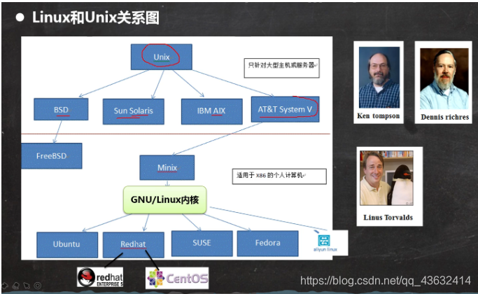

**LInux的应用领域**

服务器领域

-   Linux在服务器领域的应用是最强的
    
-   LInux免费、稳定、高效等特点在这里得到了很好的体现，尤其是在一些高端领域尤为广泛
    

嵌入式领域

-   linux运行稳定、对网络的良好支持性、低成本，且可以根据需要进行网络裁剪，内核最小可达到几百kb的特点，使近些年来在嵌入式领域的应用得到非常大的提高
-   主要应用:机顶盒、数字电视、网络电话、程控交换机、手机、PDA、智能家居、智能硬件等都是其应用领域。以后在物联网中应用会更加广泛。

**LInux的吉祥物**

-   名称：tux

* * *

**Linux主要的发行版本**

Ubuntu（乌班图）、RedHat（红帽）、CentOS

* * *

**vm与Linux的关系**  
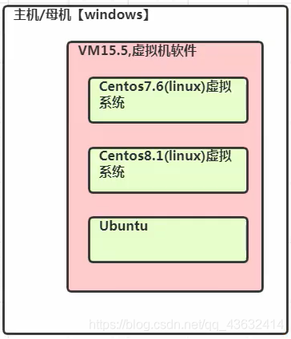

**VMware网络连接的三种模式**

桥接模式

-   VMWare会虚拟一块网卡和真正的物理网卡就行桥接，这样，发到物理网卡的所有数据包就到了VMWare虚拟机，而由VMWare发出的数据包也会通过桥从物理网卡的那端发出。桥接网络是指本地物理网卡和虚拟网卡通过VMnet0虚拟交换机进行桥接。相当于在一个局域网内创立了一个单独的主机，他可以访问这个局域网内的所有的主机
    
-   该模式下主机网卡和虚拟机网卡的IP地址处于同一个网段，子网掩码、网关、DNS等参数都相同
    
-   桥接模式下虚拟机和主机在网络上地位相等，可以理解为一台新的电脑
    

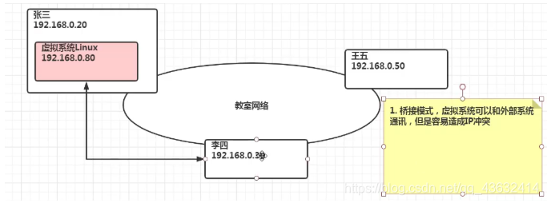

NAT模式

-   虚拟系统会通过真实主机的网络来访问外网，而真实主机相当于有两个网卡：真实网卡和虚拟网卡，真实网卡相当于链接了现实世界的真实路由器，而虚拟网卡相当于链接一个虚拟交换机/路由器（这个虚拟交换机同时链接虚拟机和真实主机）,此时虚拟机想访问外网就必须通过真实主机IP地址，而外面看来也确实是真实主机的IP地址，实则是虚拟机访问的，完全看不到虚拟网络局域的内部形式。
    
-   网络地址转换模式。虚拟机系统可以和外部系统通讯，不早造成IP冲突
    

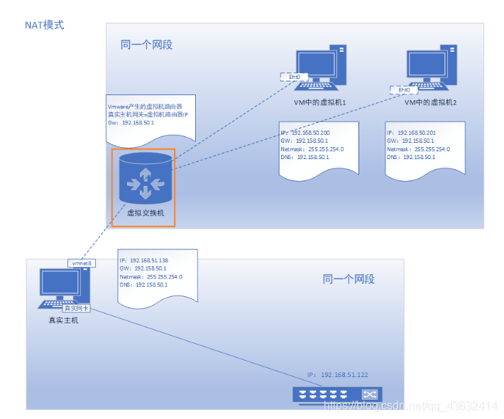

主机模式

-   他就是一个独立的系统，不和外界发生联系

## 二、Linux目录结构（重点）

### 2.1基本介绍

-   linux的文件系统是采用级层式的树状目录结构，在此结构上的最上层是根目录“/"，然后在此目录下在创建其他的目录。
-   深刻理解linux树状文件目录是非常重要的
-   记住一句很经典的话：在LInux世界里，一切皆文件

### 2.2具体的目录结构

-   /bin 【常用】（/usr/bin、/uer/local/bin)
    
    是Binary的缩写，这个目录存放着最常使用的命令
    
-   /sbin （/usr/sbin、/usr/local/sbin）
    
    s就是Super user的意思，这里存放的是系统管理员使用的系统管理程序
    
-   /home 【常用】
    
    存放普通用户的主目录，在Linux中每个用户都有一个自己的目录，一般该目录是以用户的账号命名
    
-   /root 【常用】
    
    该目录为系统管理员，也称作超级权限者的用户主目录
    
-   /lib 系统开机所需要的最基本的动态链接共享库，起作用类似于Windows里的DLL文件。几乎所有的应用程序都需要用到这些共享库
    
-   /lost+found 这个目录一般情况下是空的，当系统非法关机后，这里就存放了一些文件
    
-   etc 【常用】
    
    所有的系统管理所需要的配置文件和子目录，比如安装mysql数据库，my.conf
    
-   /usr 【常用】
    
    这是一个非常重要的目录，用户很多应用程序都放在这个目录下，类似于windows下的program files目录。
    
-   /boot 【常用】
    
    存放的是启动Linux时使用的一些核心文件，包括一些链接文件以及镜像文件
    
-   /proc 这个目录是一个虚拟的目录，他是系统内存的映射，访问这个目录来获取系统信息
    
-   /srv service缩写，该目录存放一些服务器启动后需要提取的数据
    
-   /sys 这是linux2.6内核的一个很大的变化，该目录下安装了2.6内核中新出现的一个文件系统sysfs
    
-   /tmp这个目录是用来存放一些临时文件的
    
-   /dev
    
    类似于windows的设备管理器，把所有的硬件用文件的形式存储
    
-   /media【常用】linux系统会自动识别一些设备，例如U盘，光驱等等，当识别后，linux会把识别的设备挂载到这个目录下
    
-   /mnt 【常用】
    
    系统提供该目录是为了让用户临时挂载别的系统文件，我们可以将外部的存储挂载在/mnt/上，然后进入该目录就可以查看里面的内容了。D:/mushare
    
-   /opt 这是给主机额外的安装软件所存放的目录。如安装ORACLE数据库就可以放到该目录下。默认为空
    
-   /usr/local【常用】
    
    这是另一个给主机额外安装软件所安装的目录。一般是通过编译源码的方式安装的程序
    
-   /var 【常用】
    
    这个目录中存放着在不断扩充的东西 ，习惯的将经常修改的目录放在这个目录下。包括各种日志文件
    
-   /selinux 【security-enhanced linux】
    
    SELinux是一种安全子系统，他能控制程序自能访问特定的文件，有三种工作模式，可以自行设置
    
    * * *
    

## 三、vi和vim编辑器

### 3.1 vi和vim的基本介绍

Linux系统会内置vi文本编辑器

Vim具有程序编辑的能力，可以看做是Vi的增强版本，可以主动的以字体颜色辨别语法的正确性，方便程序设计。代码补完、编译错误跳转等方便编程的功能相当丰富，在程序员中被广泛使用。（vim就是vi的增强版）

### 3.2 vi和vim常用的三种模式

-   正常模式

以vim打开一个档案就直接进入一般模式了（这是默认的模式）。在这个模式中，可以使用【上下左右】键来移动光标，你可以使用【删除字符】或【删除整行】来处理档案内容，也可以使用【复制、粘贴】来处理你的文件数据。

-   插入模式

按下i，I，o，O，a，A，r，R等任何一个字母之后才会进入编辑模式，一般来说按i就可

-   命令行模式

在这个模式中，可以提供你相关指令，完成读取、存盘、替换、离开vim、显示行号等动作则是在此模式中达成的！

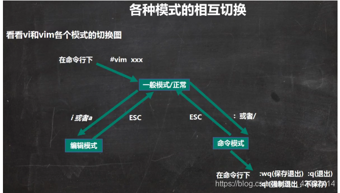

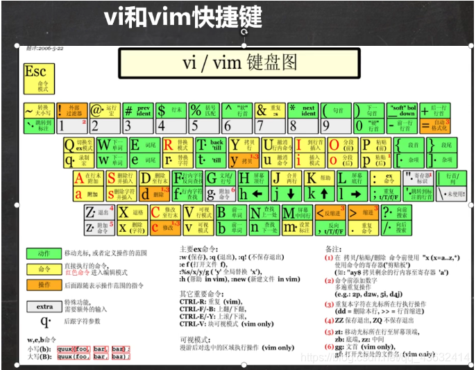

## 四、LInux开机，重启和用户登录注销

### 4.1关机和重启的命令

-   基本介绍

    shutdown -h now			立刻进行关机
    shutdown -h 1			”hello，1分钟后会关机了“
    shutdown -r now			现在重新启动计算机
    halt					关机
    reboot					重新启动
    syn					把内存的数据同步到磁盘
    
-   注意细节

1.不管是重启系统还是关闭系统，首先要运行sync命令，把内存中的数据写到磁盘中

2.目前的shutdown/reboot/halt等命令均已在关机前进行了sync

### 4.2用户登录和注销

-   基本介绍

1、登陆时尽量少用root账号登录，因为他是系统管理员，最大的权限，避免操作失误。可以利用普通用户登录，登陆后再用”su - 用户名“命令来切换成系统管理员身份

2、在提示符下输入logout即可注销用户

-   使用细节

logout注销指令在图形运行级别无效，在shell界面有效

## 五、用户管理

### 5.1基本介绍

Linux系统是一个多用户多任务的操作系统，任何一个要使用系统资源的用户，都必须先向系统管理员申请一个账号，然后以这个账号的身份进入系统

* * *

### 5.2添加用户

-   基本语法

    useradd 用户名
    
-   实列(root权限下)

    useradd hucheng
    添加一个用户chucheng，默认该用户的家目录在/home/hucheng
    
-   细节说明

    1、当用户创建成功后果，会自动的创建和用户同名的家目录
    2、也可以通过useradd -d 指定目录  新的用户名     来给新创建的用户指定家目录
    

    新建用户zhanzhiwen的home目录下的文件夹名称是muluming

### 5.3指定/修改密码

-   基本语法

    passwd 用户名
    
-   实例

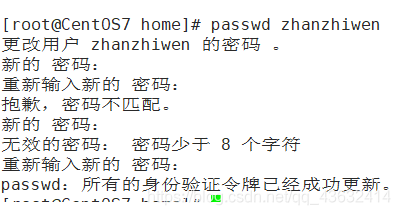

-   补充，显示当前用户所在的目录pwd

### 5.4 删除用户

-   基本语法

    userdel   用户名
    userdel -r 用户名
    
-   实例

1.删除用户zhanzhiwen，但是要保留目录

2.删除用户以及用户主目录 ，userdel -r 用户名  
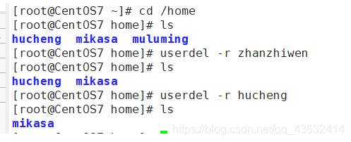

* * *

### 5.5查询用户信息指令

-   基本语法

    id 用户名
    
-   实列

-   细节说明

当用户不存在是，返回无此用户

### 5.6切换用户

-   介绍

在操作Linux时，如果当前用户的权限不够，可以通过su - 指令，切换到更高权限的用户，如root

-   基本语法

    su - 用户名
    
-   实列说明

-   细节说明

1.从权限高的用户切换到权限低的用户时，不需要输入密码，反之需要

2.当需要返回到原来用户时，使用exit/logout指令

* * *

### 5.7 查看当前用户/登录用户

-   基本语法

    whoami/who am i
    
-   实例  
    
    
-   细节说明
    

查看的是登录的用户！

* * *

### 5.8 用户组

-   介绍

类似于角色，系统可以对有共性/权限的多个用户进行统一的管理

-   新增组

    指令：groupadd 组名
    
-   删除组

指令（基本语法）：groupdel 组名

-   注意：如果当添加用户时没有指定组，会默认创建和这个用户同名的组，同时把用户放到该组里

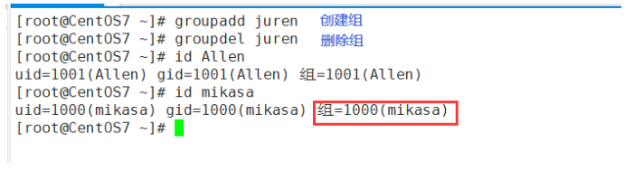

-   增加用户时直接加上组

    指令：useradd -g 用户组 用户名
    

-   移动组

    usermod -g 组名 用户名
    

* * *

### 5.9 用户和组相关文件

-   /etc/passwd 文件

用户（user）的配置文件，记录用户的各种信息

每行的含义：用户名：口令：用户标识号：组标识号：注释性描述：主目录：登录Shell

-   /etc/shadow文件

口令配置文件

每行的含义：登录名：加密口令：最后一次修改时间：最小时间间隔：最大时间间隔：警告时间：不活动时间：失效时间：标志

-   /etc/group文件

组（group）的配置文件，记录Linux包含的组的信息

每行含义：组名：口令：组标识号：组内用户列表

## 六、Linux实践——实用指令

### 6.1指定运行级别

-   基本介绍

运行级别说明：

0：关机

1：单用户【找回丢失密码】

2：多用户状态没有网络服务

3：多用户状态有网络服务

4：系统未使用保留给用户

5：图形界面

6：系统重启

常用运行级别是3和5，也可以指定默认运行级别

-   应用实例

命令：init\[0123456\]应用案例：通过init来切换不同的运行级别，比如动5-3，然后关机

    查看当前的运行级别   systemctl get-ddefault

    改变为   systemctl set-default multi-user.target

* * *

### 6.2帮助指令

-   man获得帮助信息

    基本语法：man [命令或配置文件]（功能描述：获得帮助信息）
    

在linux下隐藏文件是以 “.” 开头的

-   help指令

    基本语法：help 命令 （功能描述：获得shell内置命令的帮助信息）
    

### 6.3文件目录类

-   pwd指令

    基本语法：pwd    （功能描述：显示当前工作目录的绝对路径）
    

* * *

-   ls指令

    基本语法：ls [选项] [目录或是文件]
    

常用选项

\-a ： 显示当前目录所有的文件和目录，包括隐藏的

\-l ： 以列表的方式显示信息

* * *

-   cd指令

    基本语法：cd [参数] （功能描述：切换到指定的目录）
    

理解：绝对路径和相对路径（相对路径是针对当前位置的路径）

cd ~ 或者cd 回到自己的家目录

cd … 回到当前目录的上一级目录

* * *

-   mkdir指令

    基本语法：mkdir [选项] 要创建的目录
    

理解：mkdir指令用于创建目录（默认只能创建一级目录）

\-p :创建多级目录

* * *

-   rmdir指令（用于删除空目录）

    基本语法：rmdir [选项] 要删除的空目录
    

使用细节：

rmdir删除的是空目录，如果欲删除的目录下有内容则无法删除

\==如果需要删除非空目录，需要使用rm -rf 要删除的目录

* * *

-   touch指令（用于创建空文件）

    touch 文件名称
    

* * *

-   cp指令（copy拷贝文件导指定目录）

    cp [选项] source dest
    

常用选项：-r 递归复制真个文件夹

应用实例:

将 /home/hello.txt 拷贝到 /home/bbb 目录下

    cp /home/hello.txt /home/bbb

递归复制整个文件夹，将/home/aaa 目录下的文件全部拷贝到/home/bbb下

    cp -r /home/aaa /hom/bbb
    (是将整个目录和目录本身拷贝进来)

使用强制覆盖不提示的方法：\\cp

* * *

-   rm指令（remove，移除文件或目录）=一定要小心！！！

    基本语法：rm [选项] 要删除的文件或目录
    

常用选项

\-r : 递归删除整个文件夹

\-f ：强制删除不提示

使用细节：强制删除不提示的方式，带上-f参数即可

-   mv指令（move，移动文件与目录或重命名)（以可剪切文件夹）

    mv oldNameFile newNamefile (功能描述：重命名)
    mv /temp/movefile /targetFolder (功能描述：移动文件，剪切)
    

* * *

-   cat指令（查看文件内容）

    cat [选项] 要查看的文件
    

常用选项： -n 显示行号

使用细节：cat只能浏览文件，而不能修改文件，为了浏览方便，一般会带上管道命令 |more

    cat -n /etc/profile |more

-   more指令

more指令是一个基于VI编辑器的文本过滤器，它以全屏幕的方式按页显示文本文件的内容。more指令中内置了若干快捷键（交互的指令）

    基本语法：more 要查看的文件

操作说明

* * *

-   ln指令

软连接也称为符号链接，类似于windows里的快捷键方式，主要存放了连接其他文件的路径

    基本语法：ln -s [原文件或目录] [软链接名]（功能描述：给原文件创建一个软链接）

* * *

-   history指令

查看已经执行过历史命令，也可以执行历史指令

    history		  显示所有的历史命令
    history 10    显示最近使用过的10个指令	
    !5 			  执行历史编号为5的指令	 

* * *

### 6.4时间日期类

-   date指令-显示当前日期

    基本语法：
    date				显示当前时间
    date +%Y			显示当前年份
    date +%m			显示当前月份
    date +%d			显示当前是哪一天
    date "+%Y-%m-%d %H:%M:%S" 显示年月日时分秒
    

date指令还可以设置日期

    date -s 字符串时间
    date -s "2021-6-20 16:44:30"

-   cal指令

查看日历指令

    cal [选项]      （功能描述：不加选项，显示本月日历）
    cal 2021      显示2021整年的日历

* * *

### 6.5搜索查找类

-   find指令
    
    find指令指令 将从指定目录向下递归遍历各个子目录，将满足条件的文件或者目录显示在终端上
    

    find [搜索范围] [选项]
    

选项说明（可填选项）

选项

功能

\-name<查询方式>

按照指定的文件名查找模式查找文件

\-user<用户名>

查找属于指定用户名所有文件

\-size<文件大小>

按照指定的文件大小查找文件

说明：当查询路径下无该文件，就不会有任何显示

* * *

-   locate指令

 locate指令可以快速定位文件路径。locate命令利用事先建立的系统中所有文件名称及路径的locate数据库实现快速定位的文件名。Locate指令无需遍历整个文件系统，查询速度较快。为了保障查询结果的准确度，管理员必须定期更新locate时刻

    基本语法：locate 搜索文件

特别说明：由于locate指令基于数据进行查询，所以第一次运行前，必须是使用updatedb指令创建locate数据库

* * *

-   which指令 ，可以查看某个指令在哪个目录下

* * *

-   grep指令和管道符号 |

grep过滤查找，管道符，“|“，表示将前一个命令输出传递给后面的命令处理

    基本语法：grep [选项] 查找内容 源文件

选项：

\-n 显示匹配行及行号

\-i 忽略字母大小写

两种写法

    cat /home/hello.txt |grep -n "yes"       hello.txt文件夹中输出同样的
    grep -n "yes" /home/hello.txt

### 6.6 压缩和解压

-   gzip/gunzip指令

gzip用于压缩文件，gunzip用于解压文件的

    gzip文件		（功能描述：压缩文件，只能将文件压缩为*.gz文件
    gunzip文件    （功能描述：解压文件命令）

* * *

-   zip/unzip指令

zip用于压缩文件，unzip用于解压的，在整个项目打包发布中很有用的

    zip [选项] xxx.zip 将要压缩的内容（一般是文件和文件夹）
    uzip [选项] xxx.zip （功能描述：解压文件）

zip的常用项： -r 递归压缩，即压缩目录

zip -r myhome.zip /home/

unzip的常用项 ： -d<目录> : 指定解压后文件的存放目录

unzip -d

-   tar指令

tar指令是打包指令，最后打包后的文件是.tar.gz的文件。

    tar [选项] xxx.tar.gz   打包的内容 （功能描述：打包目录，压缩后的格式.tar.gz)

选项说明

选项

功能

\-c

产生.tar打包文件

\-v

显示详细信息

\-f

指定压缩后的文件名

\-z

打包同时压缩

\-x

解包.tar文件

    案例1：压缩多个文件，将/home/pig.txt和/home/cat.txt 压缩成  pc.tar.gz
    tar -zcvf pc.tar.gz 
    
    案例2：将/home的文件夹压缩成myhome.tar.gz
    tar -zcvf myhome.tar.gz /home/
    
    案例3：pc.tar.gz 解压到当前目录
    tar -zxvf pc.tar.gz
    
    案例4：将myhome.tar.gz  解压到/opt/tmp2目录下 mkdr/opt/tmp2/
    tar -zxvf myhome.tar.gz -C opt/tmp2

因为解压的目标地址不是当前文件夹，要去别的文件加，所以要加-C

## 七、linux的主管理和权限管理

### 7.1Liunx组的基本介绍

-   在Linux中的每个用户必须属于一个组，不能独立于组外。
-   在Linux中每个文件都有所有者、所在组、其他组的概念
    -   所有者
    -   所在组
    -   其它组
    -   改变用户所在的组

### 7.2文件/目录的所有者

-   一般文件的创建者，谁创建了该文件，就自然成为该文件的所有者
-   查看文件的所有者：

    指令： ls -ahl
    
-   修改文件所有者

    指令：chown 用户名 文件名
    

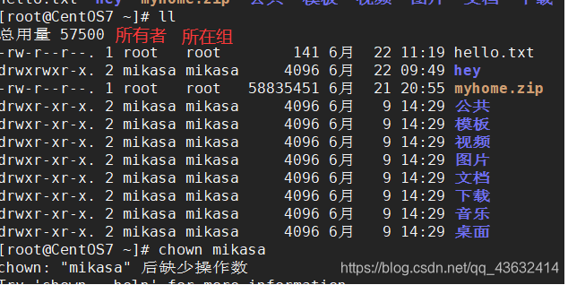

### 7.3文件/目录 所在组

-   当某个用户创建了一个文件后，这个文件的所在组就是该用户所在的组
-   查看文件/目录所在组

    ls -ahl
    
-   修改文件所在的组

    chgrp 组名 文件名
    

### 7.4其他组

除文件的所有者和所在组的用户外，系统的其他用户都是文件的其它组

### 7.5改变用户所在组

-   在添加用户时，可以指定将该用户添加到哪个组中，同样的用root的管理权限可以改变某个用户所在的组
    
-   该百年用户所在组
    

    usermod -g 组名 用户名
    usermod -d 目录名 用户名改变该用户登录的初始目录
    

### 7.6权限的基本介绍

ls -l 显示的如下内容：

    -rw-r--r--. 1 mikasa mikasa      141 6月  22 11:19 hello.txt

0-9位说明

-   1.第0位确定文件类型（d，-，l，c，b）
    -   d是目录，相当于windows的文件夹
    -   l是链接文件，相当于windows的快捷方式
    -   \-是普通文件
    -   c是字符设备文件，鼠标，键盘
    -   b是块设备，比如硬盘
-   2.第1-3位确定所有者（该文件的所有者）拥有该文件的权限 --user
-   3.第4-6位确定所属组（同用户组的）拥有该文件的权限 --Group
-   4.第7-9位确定其他用户拥有该文件的权限 --Other

* * *

rwx权限详解，难点

-   rwx作用到文件
    
    -   【r】代表可读（read）：可以读取、查看
    -   【w】代表可写（write）：可以修改，但是不代表可以删除该文件，删除一个文件的前提条件是对该文件所在的目录有些权限，才能删除该文件
    -   【x】代表可执行（execute）：可以被执行
-   rwx作用到目录
    
    -   【r】代表可读（read）：可以读取，ls查看目录内容
    -   【w】代表可写（write）：可以修改，对目录内创建+删除+重命名目录名
    -   【x】代表可执行（execute）：可以进入该目录

* * *

### 7.7文件及目录权限实际案例

-   ls -l 显示内容

    -rwxrw-r-- 1 root root 1213 Feb 2 09:39 abc
    
-   10个字符确定不同用户能对文件干什么
    -   第一个字符代表文件类型： -l d c b
    -   其余字符每三个一组（rwx）读（r）写（w）执行（x）
    -   第一组rwx：文件拥有者的权限是读、写但不能执行
    -   第二组rw-：与文件拥有者同一组的用户的权限是读、写但不能执行
    -   第三组r–：不与文件拥有者同组的其他用户的权限是都只能读
-   可用数字表示为：r=4,w=2,x=1 因此rwx=4+2+1=7
-   其他说明
    -   1 若是文件：硬件连接 若是目录：子目录数+文件数
    -   root 用户
    -   root 组
    -   1213 文件大小（字节），如果是文件夹显示4096字节
    -   Feb 2 09：39 最后修改日期
    -   abc 文件

### 7.8修改权限-chmod

-   基本说明：

通过chmod指令，可以修改文件或者目录的权限。

-   第一种方式：+ 、- 、=变更权限

u:所有者(是指文件或者是目录的拥有者) q：所有组 o：其他用户 a：所有人（u、g、o的总和）

1）chmod u=rwx,g=rx,o=x 文件/目录名

2）chmod o+w 文件/目录名

3）chmod a-x 文件/目录名

    1）给abc文件的所有者读写执行的权限，给所在组读执行权限， 给其他组读执行权限
    chmod u=rwx,g=rx,0=x abc
    
    2)给abc文件的所有者除去执行的权限，增加组写的权限
    chmod u-x,g+w abc
    
    3)给abc文件的所有用户添加读的权限
    chmod a+r abc

-   第二种方式：通过数字变更权限

r=4 w=2 x=1 rwx=4+2+1

    chmod u=rwx,g=rx,o=x 文件目录名
    相当于chmod 751 文件目录

要求：将/home/abc.txt文件的权限修改成 rwxr-xr-x,使用数字的方式实现

    chmod 755 /home/abc.txt

### 7.9修改文件所有者-chown

-   基本介绍

    chown newowener 文件/目录 改变所有者
    chown newonwner:newgroup 改变所有者和所在组
    
-   \-R 如果是目录则使其下所有子文件或目录递归生效（recursion）

    文件   chown mikasa /home/mikasa/hello.txt
    目录   chown -R mikasa /home/qianxin
    

### 7.10修改文件/所在组-chgrp

-   基本介绍

    chgrp newgroup 文件/目d录 [改变所在组]
    
-   \-R 如果是目录则使其下所有子文件或目录递归生效（recursion）

### 7.11对文件夹(目录）的rwx的细节讨论

-   x：表示可有进入到该目录，比如cd
-   r：表示可以ls，将目录的内容显示
-   w：表示可以在该目录删除或者创建文件

## 八、crond任务调度

### 8.1crontab 进行 定时任务的设置

-   概述
    
    -   任务调度：是指系统在某个时间执行的特定的命令或程序。
        
    -   任务调度分类.
        
        -   系统工作：有些重要的工作必须周而复始地执行。如病毒扫描等
        -   个别用户工作：个别用户可能希望执行某些程序，比如对mysql数据库的备份
    -   基本语法
        

    crontab [选项]
    常用选项有：
    	-e				编辑crontab定时任务
    	-l				查询crontab任务
    	-r				删除当前用户所有的crontab任务
    

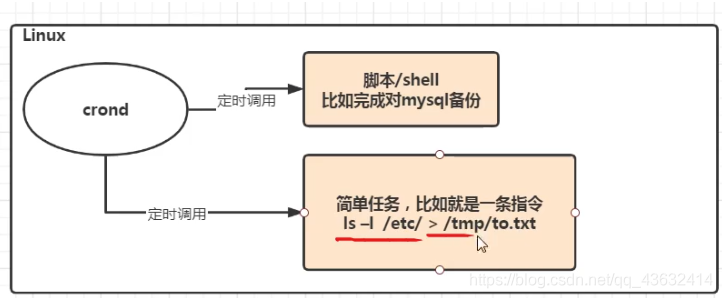

-   快速入门
    
    -   设置任务调度文件：/etc/crontab
        
    -   设置个人任务调度。执行crontab -e命令
        
    -   接着输入任务到调度文件
        
    -   如：
        
            */1 * * * * ls -l /etc/ > /tmp/to.txt
            意思说每个小时的每分钟执行ls -l /etc/ > /tmp/to.txt 命令
        
    -   参数细节说明
        
    -   5个占位符的说明
        

-   特殊符号说明
    
    特殊符号
    
    含义
    
    \*
    
    代表任何时间。比如第一个 “ \* ” 就代表一小时中每分钟都执行一次的意识
    
    ‘
    
    代表不连续的时间。比如“0 8，12，16 \*\*\* 命令，就代表在每天的8点0分，12点0分，16点0分都执行一次命令
    
    \-
    
    代表连续的时间范围。比如”0 5 \* \* 1-6 命令“，代表在周一到周六的凌晨5点0分执行命令
    
    \*/n
    
    代表每隔多久执行一次。比如 ” \*/10 \* \* \* \* 命令" ，代表每隔10分钟就执行一遍命令
    
-   特定时间执行任务案例
    

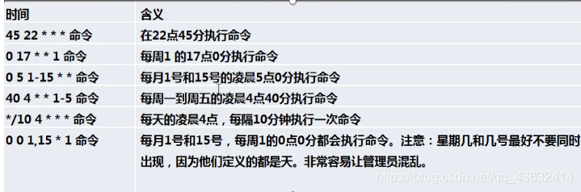  
\*

    应用实列：
    案例1：每隔1分钟，就将当前的日期信息，追加到/tmp/mydate文件中
    	crontab -e
    		*/1 * * * * data >> /tmp/mydata
    	
    案例2：每隔2分钟，将当前日期和日历都追加到/home/mycal文件中
    	第一步 编辑一个脚本文件
    		vim /home/my.sh
    				date >> /home/mycal
    				cal >> /home/mycal
    	第二步：
    		crontab -e
    				*/1 * * * * /home/my.sh
    				
    案列3：每天凌晨2：00将mysql数据库testdb，备份到文件中，提示：指令为mysqldump -u root -p密码 数据库 >> /home/bd.bak
    	第一步：crontab -e
    	第二步：0 2 * * * mysqldump -u root -proot testdb > /home/db.bak

### 8.2 at定时任务

-   基本介绍
    
    -   at命令是一次性定时计划任务，at的守护进程atd会以后台模式运行，检查作业队列来运行
    -   默认情况下，atd守护进程每60秒检查作业队列，有作业时，会检查作业运行时间，如果时间与当前时间匹配，则运行此作业
    -   at命令是一次性定时任务计划，执行完一个任务后不再执行此任务了
    -   在使用at命令的时候，一定要保证atd进程的启动，可以使用相关指令来查看
    
        ps -ef
        
    
-   at命令格式
    
        at [选项] [时间]
        ctrl + D 结束at命令输入（两次）
    
    

-   at命令选项  
    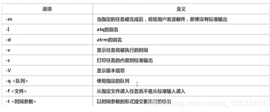
    
-   at时间定义的方法
    

-   相关方法
    
    -   atq命令，来查看系统中没有执行的工作任务
    -   atrm 编号 删除已经设置的任务
-   案列
    
    -   2天后的下午5点执行/bin/ls /home

-   明天17点钟，输出时间到指定文件内 比如/root/date100.log

## 九、Linux磁盘分区、挂载

### 9.1Linux分区

-   原理介绍
    -   1.  Linux来说无论有几个分区，分给哪一目录使用，它归根结底就只有一个根目录，一个独立且唯一的文件结构，Linux中每个分区都是用来组成整个文件系统的一部分
        2.  Linux采用了一种叫”载入“的处理方法，它的整个文件系统包含了一整套的目录，且将一个分区和一个目录联系起来。这时要载入的一个分区将使它的存储空间在一个目录下获得

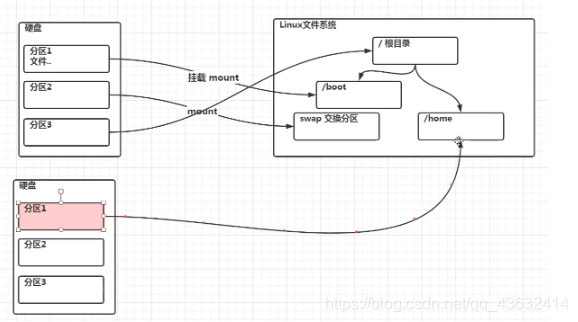

-   硬盘shuo’ming
    
    -   Linux硬盘分IDE硬盘和SCSI硬盘，目前基本上是SCSI硬盘
    -   对于IDE硬盘，驱动驱动标识符为” hdx~ “，其中”hd“表明分区所在的设备类型，这里是指IDE硬盘了。”x“为盘号（a为基本盘，b为基本从属盘，c为辅助主盘，d为辅助从属盘），”~“代表分区，前四个分区用数字1到4表示，他们是主分区和拓展分区；从5开始就是逻辑分区。例，hda3表示为第一个IDE硬盘上的第三个主分区或拓展分区，hdb2表示为第二个IDE硬盘上的第二个主分区或拓展分区
    -   对于SCSI硬盘则标识为”sdx~“，SCSI硬盘是用”sd“来表示分区所在设备的类型的，其余则和IDE硬盘的标识方式一样
-   查看所有的设备挂载情况
    
        命令：lsblk  或者 lsblk -f
    
    

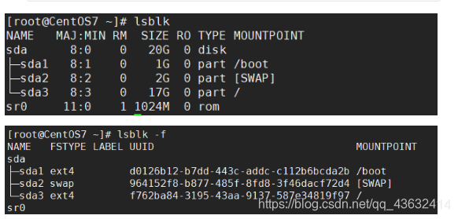

-   针对第二张图
    -   sda下指得是分区情况
        -   FSTYPE 指的是文件类型
    -   UUID值得是分区得唯一标识符（40个位）
    -   MOUNTPOIN 挂载点

### 9.2挂载的经典案例

以增加一块硬盘为例来熟悉磁盘的相关指令和深入理解磁盘分区、挂载、卸载的概念。

如何为linux系统增加一块硬盘？  
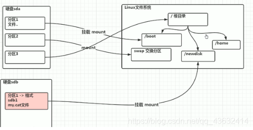

-   1.虚拟机添加硬盘
    
    -   在vmware上实现
    -   重启虚拟机
    -   重启后的分区情况\[外链图片转存失败,源站可能有防盗链机制,建议将图片保存下来直接上传  
        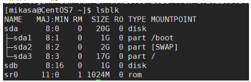
-   2.分区
    
    -   分区命令
        
            fdisk /dev/sdb
        
    -   (dev（device)这个目录中包含了所有Linux系统中使用的外部设备。但是不是存放外部设备的驱动程序。它实际上是一个访问这些外部设备的端口就。我们可以非常方便的去访问这些外部设备，和访问一个文件，一个目录没有任何区别）
        
    -   开始对 /sdb分区
        
    
        m	显示命令列表
        p	显示磁盘分区 同 fdisk -l
        n	新增分区
        d	删除分区
        w	写入并退出
        说明：开始分区后输入n，新增分区，然后选者p，分区类型为主分区。两次回车默认剩余全部空间。最后输入w写入分区并退出，若不保存退出输入q
        
    

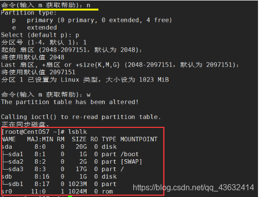

-   3.格式化
    
    -   格式化磁盘
    -   分区命令：
    
        mkfs -f ext4 /dev/sdb1
        
    -   其中ext4是分区类型

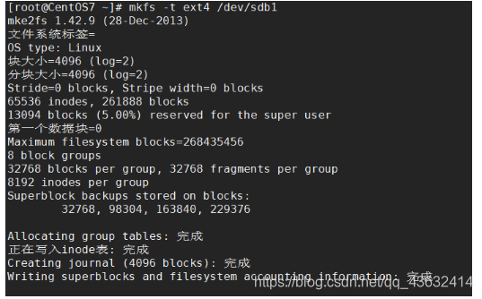

-   4.挂载（将一个分区与一个目录联系起来）
    
        挂载令： mount 设备名称 挂载目录
        ！！卸载命令： umout 设备名称（或者已挂载的目录）
    
    

用命令行挂载，重启后就会失效

-   5设置可以自动挂载
    
    -   永久挂载：通过修改/etc/fstab实现挂载
    -   添加完成后，执行mount -a立即生效

### 9.3磁盘情况查询

-   查询系统整体磁盘使用情况
    
    -   基本语法
    
        df -h
        
    -   应用实例：查询系统整体磁盘使用情况（使用率到了80以上就正常了）

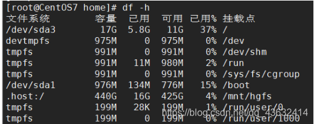

-   查询指定目录的磁盘占用情况
    
    -   基本语法
    
        du 选型 /目录
        
    -   查询指定目录的磁盘占用情况，默认为当前目录
    -   选项
    
        -s		指定目录占用大小汇总
        -h		带计量单位
        -a		含文件
        --max-depth=1 子目录深度
        -c 		列出明细的同时，增加汇总值
        
    -   案例：查询opt目录的磁盘占用情况，深度为1

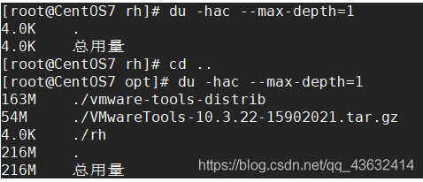

-   磁盘情况-工作实用指令
    
    -   1.统计/opt文件夹下文件的个数
        
            ls -l /opt | grep "^-" | wc -l
        
    -   2.统计/opt文件夹下目录的个数
        
            ls -l /opt | grep "^d" | wc -l
        
    -   3.统计/opt文件夹下文件的个数，包括子文件夹里的
        
            ls -lR /opt | grep "^-" | wc -l
        
    -   4.统计/opt文件夹下目录的个数，包括子文件夹里的
        
            ls -lR /opt | grep "^d" | wc -l
        
    -   5.以树状显示目录结构
        
            yum install tree
            tree /home
        
        

## 十、LInux网络配置

### 10.1Linux网络配置原理图

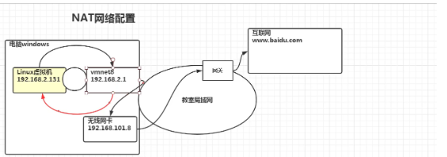

### 10.2配置一个指定的ip

-   直接修改配置文件来制定IP，并可以连接到外网（cxy推荐）
-   编辑 vim /etc /sysconfig/network-scripts/ifcfg-ens33
-   修改前

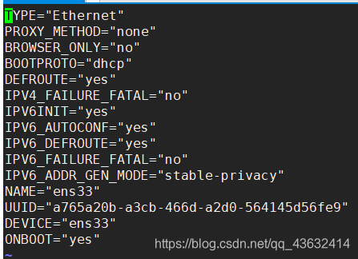

-   要求：将IP地址配置为静态的，比如ip地址为192.168.200.130
    
-   修改后  
    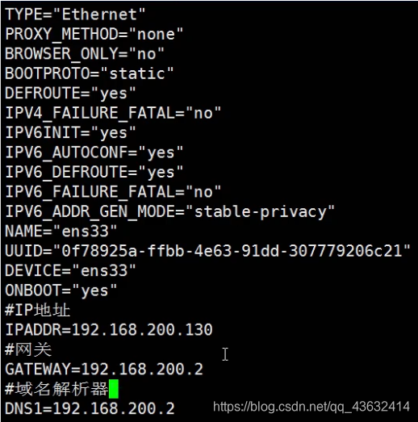
    
-   ifcfg-ens33文件说明
    

-   重启网络服务或者重启兄系统生效
    
        service network restart
        reboot
    
-   ping指令
    

    ping ip(或域名)    （测试连通性）
    

### 10.3设置主机名和hosts映射

-   设置hosts映射
    
    -   windows
    
        再C:\windows\System32\drivers\etc\hosts 文件指定即可
        
    -   liunx
    
        在/etc/hosts 文件 指定
        
    
-   主机名解析过程分析（hosts、DNS）
    
    -   hosts文件是什么：一个文本文件，用来记录IP和hostname（主机名）的映射关系
    -   DNS（Domain Name System，域名系统）：是互联网上作为域名和IP地址相互映射的一个分布式数据库
-   主机名解析机制分析  
    应用实例：用户在浏览器输输入了www.baidu.com
    
    -   1.浏览器先检查浏览器缓存中有没有该域名解析ip地址，有就先调用这个IP完成解析；如果没有，就检查DNS解析器缓存，如果有就直接返回ip完成解析。（这两个缓存可以理解为本地解析器缓存）
        
        （一般来说，当电脑第一次成功访问某一网站后，在一定的时间内，浏览器或者操作系统会缓存它的ip地址DNS解析记录，如在命令行输入
        
            ipconfig /displaydns		//DNS缓存解析
            ipconifg /flushdns			//手动清理dns缓存
        
    -   2.如果本地解析器缓存没有找到对应的映射，则检查系统系统中的hosts文件中有没有配置对应的域名ip映射。如果有，则完成解析并返回
        
    -   3.如果本地DNS解析器缓存和hosts文件中均没有找到对应的ip，则到域名服务DNS进行解析
        
    -   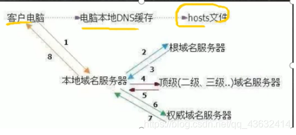
        

## 十一、进程管理

### 11.1基本介绍

-   在Linux中，每一个执行的程序都被称为一个进程。每一个进程都被分配一个ID号（pid，进程号）
    
    -   windows下的pid

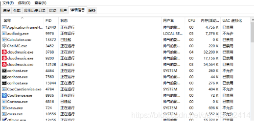

-   linux：top指令

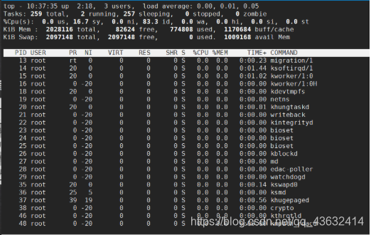

-   每个进程都可能以两种方式存在。前台与后台，所谓前台进程就是用户目前屏幕上可以进行操作的。后台进程则是实际在操作，但由于屏幕上无法看到的进程，通常使用后台方式执行。
    
-   一般系统的服务都是以后台进程的方式存在，而且都会常驻在系统中。直到关机才会结束
    

### 11.2显示系统执行的进程

-   ps命令是用来查看目前系统中，有哪些正在执行的进程 ，以及他们的执行状况。可以不加任何参数

ps显示的信息选项

字段

说明

PID

进程识别号

TTY

终端机号

TIME

此进程所消耗CPU时间

CMD

正在执行的命令或进程名

    ps -a:显示当前终端的所有进程信息
    ps -u:以用户的格式显示进程信息
    ps -x:显示后台进程运行的参数

-   执行ps -aux

-   参数解释
    
    -   USER：进程执行用户
    -   PID：进程号
    -   %CPU：当前进程占用cpu的百分比
    -   %MEM：占用物理内存的百分比
    -   VSZ：进程占用虚拟内存大小（KB）
    -   RSS：进程占用的物理内存的大小（KB）
    -   TTY：终端名称
    -   STAT：运行状态，S-表示sleep休眠、s-表示该进程是会话的先导进程，N-表示进程拥有比普通优先级更低的优先级，R-表示正在运行，D-短期等待，z-僵尸进程，T-被跟踪或者被停止等等
    -   STARTED：执行的开始时间
    -   TIME：占用CPU时间
    -   COMMAND：启动进程所用的命令和参数，如果过长会被截断显示
-   以全格式显示当前所有的进程，查看进程的父进程
    
        ps -ef   是以全格式显示当前所有的进程
        
        -e	显示所有的进程
        -f	全格式
        
        ps -ef|grep xxx
        是BSD风格
    
    

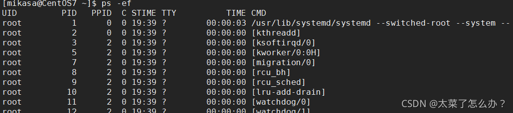

-   UID：用户ID
    
-   PID：进程ID
    
-   PPID：父进程ID
    
-   C：cpu用于计算执行优先的因子。数值越大，表明进程是CPU密集型运算，执行优先级会降低；数值越小，表明进程是I/O密集型运算，执行优先级会提高
    
-   STIME：进程启动时间
    
-   TTY：完整的终端名称
    
-   TIME：CPU占用时间
    
-   CMD启动进程所用的命令和参数
    
-       ps -ef|grep sshd
        

-   sshd进程是1号进程的子进程，
    
-   终止进程kill和killall
    
    -   若是某一个进程执行一半需要停止时，或是已消了很大的系统资源时，此时可以考虑停止该进程。使用kill命令来完成此项任务
    -   基本语法
    
        kill [选项] 进程号		功能描述：通过进程号杀死进程
        killall 进程名称 		功能描述：通过进程名杀死进程也支持通配符，这在系统因负载过的很慢时很有用
        
    -   常用选项：\-9 表示强迫进程立即停止
        
    -   案例
        
        -   踢掉某个非法登录用户（mikasa）

    ps- ef|grep sshd后可知用户mikasa登录的进程号为9583
    kill 进程号
    kill 9583
    
    用户mikasa的连接关闭

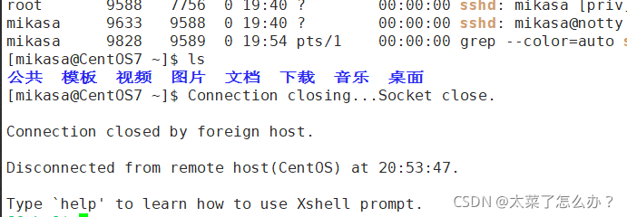

-   终止远程登录服务sshd，在适当时候再次重启sshd服务  
    

    kill 7756
    结束远程登录服务sshd后用户无法通过xshell连上Linux虚拟机
    
    回复sshd服务
    /bin/systemctl start sshd.service
    
-   终止多个gedit

        killall gedit
    
-   强制杀掉一个终端

     先ps -aux | grep bash
     观察出终端的进程号
     再
     killall -9 bash对应的进程号
    

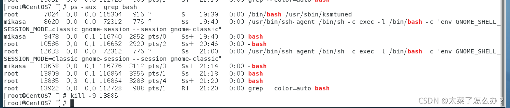

### 11.3查看进程树pstree

-   基本语法

    pstree [选项]         可以更加直观的来看进程信息
    
-   常用选项

    -p	树状形式显示进程的pid
    -u	树状形式显示进程的所属用户
    

## 十二、服务（service）管理

### 12.1介绍

服务（service）本质就是进程，但是时运行在后台的，通常都会监听某个端口，等待其他程序的请求，比如（mysqld，sshd 防火墙等），因此我们又称为守护进程，是Linux中非常重要的知识点

-   service管理指令
    
        service 服务名 [start| stop| restart| reload | status]
    
-   在CentOS7.0后很多服务不再使用service，而是systemctl
    
-   service指令管理的服务在 /etc/init.d查看
    
-   
    
-   案例
    

    使用servce指令，查看，关闭，启动network[不要在xshell中执行，关闭网络后，连接sshd服务会断开连接]
    
-   查看服务名：
    
    -   方式1：使用setup——>系统服务，就可以看到全部
        -   带\*号的服务是随着linux的启动自动启动，没有带 \*号的都是需要手动启动的
        -   这里记一个比较呆比的事情，退出按Tab

-   方式2：/etc/init.d 看到service指令管理的服务ls -l /etc/init.d
    
-   额外扩展：为什么linux很多服务以d结尾？
    
    -   d代表deamon 守护进程
    -   Linux的大多数服务就是用守护进程
    -   守护进程是运行在Linux服务器后台的一种服务程序
    -   它周期地执行某种任务或等待处理某些发生的事件
    -   比如：xinetd提供网络服务，sshd提供ssh登录服务，httpd提供web服务

### 12.2服务的运行级别

-   linux系统有七种运行级别（runlevel）：常用的是级别3和5
    -   运行级别0：系统停机状态，系统默认运行级别不能设为0，否则不能正常启动
    -   运行级别1：单用户工作状态，root权限，用于系统维护，禁止远程登录
    -   运行级别2：多用户状态（没有NFS），不支持网络
    -   运行级别3：完全的多用户状态（有NFS），登录后进入控制台命令行模式
    -   运行级别4：系统未使用，保留
    -   运行级别5：X11控制台，登陆后进入图形GUI模式
    -   运行级别6：系统正常关闭并重启，默认运行级别不能设为6，否则不能正常启动
-   开机的流程说明

-   CentOS7运行级别说明
    
    -   在/etc/initab，进行了简化如下
    
        multi-user.target:analogous to runlevel 3
        graphical.target:analogous to runlevel 5
        
    -       #to view current default target,run:
            systemctl get-default
            
    -       #To set a default target,run:
            systemctl set-default TARGET.target
            
    

### 12.3chkconfig指令

-   介绍
    -   1.通过chkconfig命令可以给服务的各个运行级别设置自 启动/关闭
    -   2.chkconfig指令管理的服务在 /etc/init.d查看
    -   注意：CentOS7.0后，很多服务使用systemctl管理
-   基本语法

    chkconfig --list [| grep xxx]				查看服务
    chkconfig 服务名 --list					  查看服务
    chkconfig --level 5 服务名 on/off            对服务在各等级下的状态进行控制
    

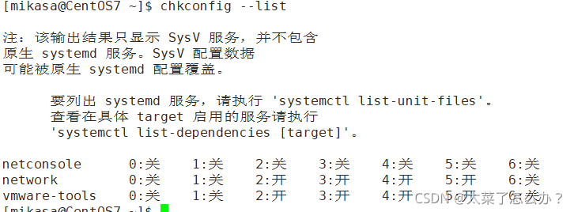

-   案列

    对network服务进行操作，把network在3运行级别关闭自启动
    chkconfig --level 3 network off
    
-   注意：chkconfig重新设置服务后自启动或关闭，需要重启机器reboot生效

### 12.4systemctl命令

-   systemctl管理命令
    
        systemctl [start | stop |restart |status ] 服务名
    
    
    -   systemctl指令管理的服务咋/usr/lib/systemd/system中查看
-   systemctl设置服务的自启动状态
    
        systemctl list-unit-files [|grep 服务名] (查看服务开机启动状态，grep可进行过滤)
        systemctl enable 服务名				（设置服务开机启动）
        systemctl disable 服务名 			(关闭服务开机启动)关闭和开启都是默认的3和5两级别
        systemctl is-enabled 服务名             (查询某个服务是否是自启动的)
    
-   引用案列：
    
        ll /usr/lib/systemd/system |grep fire 查找防火墙服务
        
        systemctl list-unit-files | grep firewalld 查看当防火墙的服务状态
        
        systemctl is-enabled firewalld  查看防火墙服务是否是自启的
    
    
    ​    
    ​    查看当前防火墙的状态，关闭防火墙和重启防火墙
    ​    systemctl status firewalld
    ​    
        停止防火墙
        systemctl stop firewalld
        
        启动防火墙、
        systemctl s
    
    

-   细节点
    
    -   关闭或者启动防火墙后，立即生效。\[telnet测试 某个端口即可\]
    -   这种方式只是临时生效，当重启系统后，还是回归以前对服务的设置
    -   如果希望设置某个服务自启动或关闭永久生效，要使用systemctl \[enable|disable\]服务名

### 12.5打开或者关闭指定端口

在真正的生产环境，往往需要将防火墙打开，来了，如果我们把防火墙打开，那么外部请求数据包就不能给服务器监听端口通讯。，这时，需要打开指定的端口。比如80，22，8080 该怎么做呢

-   firewall指令
    
    -   打开端口
    
        firewall-cmd --permanent --add-port=端口号/协议
        
    -   关闭端口
    
        firewall-cmd --permanent --remove-port	=端口号/协议
        
    -   无论是关闭还是开启端口都需要重新载入防火墙才能生效
    
        firewall-cmd --reload
        
    -   查询端口是否开放
    
        firewall-cmd --query-port=端口/协议
        
    
-   案例
    
    -   启用防火墙，测试111端口是否能telnet
        
    -   开放111端口  
        
        
    -   再次关闭111端口  
        
        

## 十三、动态监控

### 13.1介绍

 top和ps命令很相似。他们都用来显示正在执行的进程Top和ps最大的不同处在于top在执行一段时间可以更行正在运行的进程

-   基本语法

    top [选项]
    
-   选项说明

选项

功能

实例

\-d 秒数

指定top命令每隔几秒更新。默认是3秒

top -d 5

\-i

是top不显示任何闲置或者僵死进程

\-p

通过指定监控进程ID来仅仅监控某个进程的状态

-   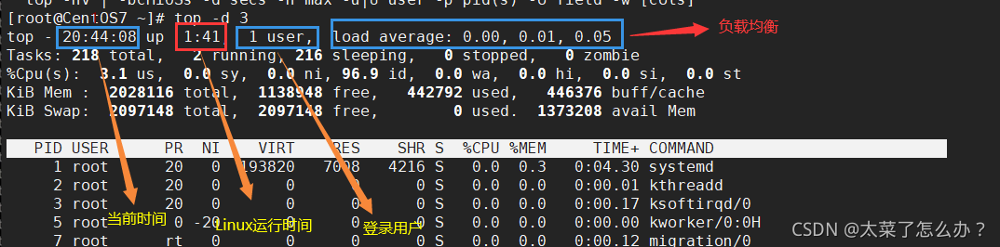
    
-   僵死进程：进程已经死掉了（进程运行结束），但是内存没有被释放掉。僵死进程需要定时清除！！  
    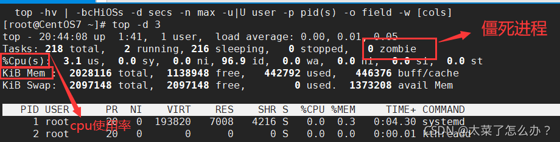
    
-   其中cpu使用率和KiB Mem(内存管理）最为重要
    

### 13.2动态监控进程的交互操作

-   交互操作说明

操作

功能

P

以CPU施一公率排序，默认就是此项

M

以内存使用率排序

N

以PID排序

q

退出top

-   实例
    
        案例1.监视特定用户，比如说监控mikasa用户
        top：输入此命令，按回车键，查看执行的进程
        然后输入“u”,回车，在输入用户名，即可
        
        案例2：终止指令的进程
        先输入top指令后，在输入“k“ ，在输入想要终止的进程号
        
        案例3：指定系统状态更新的时间（每隔10秒自动更新）（默认的是3秒）
        top -d 10
    
    

### 13.3监控网络状态

-   查看系统网络情况netstat
    
    -   基本语法
    
        netstat [选项]
        
    -   选项说明
    
        -an 按一定顺序排列输出
        -p 显示哪个进程在用
        
    

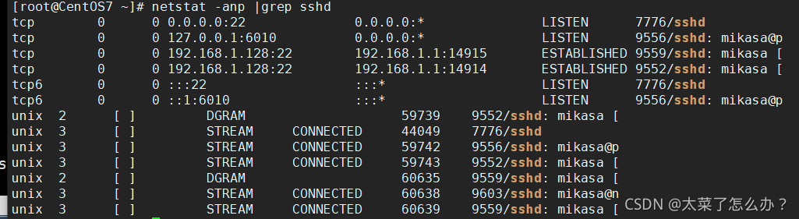

-   检测主机连接命令ping
    
    -   是一种网络检测工具，它主要是用来检测远程主机是否正常，或是两部主机间的网线或网卡故障

## 十四、RPM与YUM

### 14.1rpm包的管理

-   介绍
    
    -   rpm用于互联网下载包的打包及安装工具，它包含在某些LInux分发版中。它生成具有.RPM拓展名的文件。RPM是RedHat Package Manager （RedHat软件包管理工具）的缩写，类似windows的setup.ext，这一文件格式名称虽然打上了RedHat的标志，但理念是通用的。
    -   Linux的分发版都有采用（suse，redhat，centos等），可以说是公用的行业标准。
-   rpm包的简单查询指令
    
    -   查询已安装的rpm列表
    
        rpm -qa|grep xxx
        
        查看当前系统是否安装firefoxrpm -qa | grep firefox
        
    
    
    
    -   rpm包名基本格式
    
        一个rpm包名：firefox-60.2.2-1.el7.centos.x86_64
        名称：firefox
        版本号：60.2.2-1
        适用操作系统：el7.centos.x86_64     表示centos7.x的64位系统
        			（如果似乎i686、i386表示32位系统，noarch表示通用）
        
    
-   rpm包的其它查询指令
    
    -   rpm -qa 查询所安装的所rpm包软件包
    
        rpm -qa | more
        rpm -qa | grep xxx(如：rpm -qa | grep firefox)
        
    -   rpm -q 软件包名 查询软件包信息
    
        案例：rpm -q firefox
        
    -   rpm -qi 软件包名 查询软件包信息
    
        rpm -qi firefox
        
    

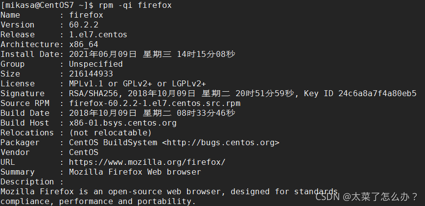

-   rpm -ql 软件包名 查询软件包中的文件
-   rpm -qf 文件全路径名 查询文件所属的软件包

    rpm -af /etd/shadow
    

    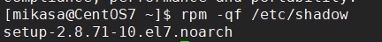
    
-   安装rpm包
    
    -   基本语法
    
        rpm -ivh RPM包全路径名称
        
        rpm -ivh /opt/firefox      (先按tab补全再回车)
        
    -   参数说明
    
        i=install   安装
        v=verbose   提示
        h=hash      进度条
        
    
-   卸载rpm包
    
    -   基本语法
    
        rpm -e RPM包的名称     //erass
        
        rpm -e firefox       删除firefox 软件包
        
    -   注意
        
        -   如果其它软件包依赖于要卸载的软件包，卸载时则会产生错误的信息
        -   如果必须要删除这个软件包，可以增加参数 --nodeps，就可以强制删除，但是一般不推荐这么做，因为依赖于该软件包的程序可能无法运行
        
            rpm -e --nodeps 软件包名
            
        

### 14.2yum

-   _**介绍**_：Yum是一个Shell前端软件包管理器。基于RPM包管理，能够从指定的服务器自动下载RPM包并安装，可以自动处理依赖关系，并且一次安装所有依赖的软件包
    
-   **yum的基本指令**
    
        查询yum服务器是否有需要安装的软件（软件列表）
        yum list|grep xx
        
        安装指定的yum包（下载安装
        yum install xxx 
    
-   实列：使用yum的方式安装firefox
    
        rpm -e firefox              先卸载centos中的firefox
        yum list | grep firefox		 查询firefox的软件
        yum install firefox			下载！

## 参考

仅用于个人学习

[B站韩顺平版Linux学习笔记（很全啊！）_韩顺平linux资料-CSDN博客](https://blog.csdn.net/qq_43632414/article/details/118067056?ops_request_misc=%7B%22request%5Fid%22%3A%22172257936116800184168400%22%2C%22scm%22%3A%2220140713.130102334.pc%5Fall.%22%7D&request_id=172257936116800184168400&biz_id=0&utm_medium=distribute.pc_search_result.none-task-blog-2~all~first_rank_ecpm_v1~times_rank-13-118067056-null-null.142^v100^pc_search_result_base5&utm_term=韩顺平linux笔记&spm=1018.2226.3001.4187)