韩顺平图解Linux全面升级 https://www.bilibili.com/video/BV1Sv411r7vd  
27 小时 、153 讲， 2021 韩顺平 一周学会Linux

## 简介

  

## 目录

    P001_韩顺平图解Linux全面升级_课程内容    20:37
    P002_韩顺平图解Linux全面升级_应用领域    05:05
    P003_韩顺平图解Linux全面升级_概述    16:37
    P004_韩顺平图解Linux全面升级_Linux与Unix    18:09
    P005_韩顺平图解Linux全面升级_vmware15.5安装    17:36
    P006_韩顺平图解Linux全面升级_CentOS7.6安装    35:15
    P007_韩顺平图解Linux全面升级_网络连接三种方式    16:01
    P008_韩顺平图解Linux全面升级_虚拟机克隆    09:13
    P009_韩顺平图解Linux全面升级_虚拟机快照    09:15
    P010_韩顺平图解Linux全面升级_虚拟机迁移删除    06:47
    P011_韩顺平图解Linux全面升级_vmtools    20:39
    P012_韩顺平图解Linux全面升级_目录结构介绍    07:50
    P013_韩顺平图解Linux全面升级_目录结构详解    18:44
    P014_韩顺平图解Linux全面升级_远程登录    15:30
    P015_韩顺平图解Linux全面升级_远程文件传输    13:58
    P016_韩顺平图解Linux全面升级_vi vim快速入门    08:32
    P017_韩顺平图解Linux全面升级_vi vim快捷键    19:09
    P018_韩顺平图解Linux全面升级_vi vim内容梳理    06:02
    P019_韩顺平图解Linux全面升级_关机重启    07:54
    P020_韩顺平图解Linux全面升级_登录注销    08:41
    P021_韩顺平图解Linux全面升级_用户管理(1)    15:26
    P022_韩顺平图解Linux全面升级_用户管理(2)    05:22
    P023_韩顺平图解Linux全面升级_用户管理(3)    18:45
    P024_韩顺平图解Linux全面升级_用户管理(4)    08:37    
    P025_韩顺平图解Linux全面升级_运行级别    12:03
    P026_韩顺平图解Linux全面升级_找回root密码    08:23
    P027_韩顺平图解Linux全面升级_帮助指令    08:46
    P028_韩顺平图解Linux全面升级_文件目录指令(1)    15:27
    P029_韩顺平图解Linux全面升级_文件目录指令(2)    07:33
    P030_韩顺平图解Linux全面升级_文件目录指令(3)    12:43
    P031_韩顺平图解Linux全面升级_文件目录指令(4)    14:04
    P032_韩顺平图解Linux全面升级_文件目录指令(5)    24:21
    P033_韩顺平图解Linux全面升级_文件目录指令(6)    10:08
    P034_韩顺平图解Linux全面升级_时间日期指令    07:51
    P035_韩顺平图解Linux全面升级_查找指令(1)    13:33
    P036_韩顺平图解Linux全面升级_查找指令(2)    08:22
    P037_韩顺平图解Linux全面升级_压缩和解压(1)    11:18
    P038_韩顺平图解Linux全面升级_压缩和解压(2)    09:59
    P039_韩顺平图解Linux全面升级_实用指令小结    04:57
    P040_韩顺平图解Linux全面升级_linux组的介绍    07:35
    P041_韩顺平图解Linux全面升级_所有者    04:03
    P042_韩顺平图解Linux全面升级_所在组    08:56
    P043_韩顺平图解Linux全面升级_修改所在组    04:15
    P044_韩顺平图解Linux全面升级_rwx权限    15:46
    P045_韩顺平图解Linux全面升级_权限说明案例    06:48
    P046_韩顺平图解Linux全面升级_修改权限    09:32
    P047_韩顺平图解Linux全面升级_修改所有者和所在组    09:15
    P048_韩顺平图解Linux全面升级_权限管理应用实例(1)    21:57
    P049_韩顺平图解Linux全面升级_权限管理应用实例(2)    17:43
    P050_韩顺平图解Linux全面升级_权限管理应用实例(3)    09:50
    P051_韩顺平图解Linux全面升级_权限管理应用实例(4)    14:34
    P052_韩顺平图解Linux全面升级_crond快速入门    11:01
    P053_韩顺平图解Linux全面升级_crond时间规则    05:05
    P054_韩顺平图解Linux全面升级_crond应用实例    14:55
    P055_韩顺平图解Linux全面升级_at任务调度机制    12:36
    P056_韩顺平图解Linux全面升级_at任务调度实例    10:09
    P057_韩顺平图解Linux全面升级_任务调度小结    09:49
    P058_韩顺平图解Linux全面升级_磁盘分区机制    16:04
    P059_韩顺平图解Linux全面升级_增加磁盘应用实例    23:02
    P060_韩顺平图解Linux全面升级_磁盘情况查询    07:57
    P061_韩顺平图解Linux全面升级_磁盘实用指令    07:24
    P062_韩顺平图解Linux全面升级_磁盘分区挂载小结    10:30
    P063_韩顺平图解Linux全面升级_NAT网络原理图    13:42
    P064_韩顺平图解Linux全面升级_网络配置指令    07:16
    P065_韩顺平图解Linux全面升级_网络配置实例    12:10
    P066_韩顺平图解Linux全面升级_主机名和hosts映射    22:08
    P067_韩顺平图解Linux全面升级_网络配置小结    09:42
    P068_韩顺平图解Linux全面升级_进程基本介绍    06:22
    P069_韩顺平图解Linux全面升级_ps指令详解    10:21
    P070_韩顺平图解Linux全面升级_父子进程    08:21
    P071_韩顺平图解Linux全面升级_终止进程    16:15
    P072_韩顺平图解Linux全面升级_pstree指令    04:11
    P073_韩顺平图解Linux全面升级_服务管理(1)    13:42
    P074_韩顺平图解Linux全面升级_服务管理(2)    06:30
    P075_韩顺平图解Linux全面升级_服务管理(3)    06:40
    P076_韩顺平图解Linux全面升级_服务管理(4)    22:01
    P077_韩顺平图解Linux全面升级_服务管理(5)    07:56
    P078_韩顺平图解Linux全面升级_动态监控系统(1)    09:49
    P079_韩顺平图解Linux全面升级_动态监控系统(2)    08:01
    P080_韩顺平图解Linux全面升级_监控网络状态    16:14
    P081_韩顺平图解Linux全面升级_进程管理小结    11:02
    P082_韩顺平图解Linux全面升级_rpm管理(1)    08:13
    P083_韩顺平图解Linux全面升级_rpm管理(2)    07:36
    P084_韩顺平图解Linux全面升级_yum    06:47
    P085_韩顺平图解Linux全面升级_软件包管理小结    03:14
    P086_韩顺平图解Linux全面升级_安装配置JDK8    12:45
    P087_韩顺平图解Linux全面升级_安装配置tomcat8    07:16
    P088_韩顺平图解Linux全面升级_安装配置idea2020    07:03
    P089_韩顺平图解Linux全面升级_安装配置mysql5.7    15:14
    P090_韩顺平图解Linux全面升级_小结    02:13
    P091_韩顺平图解Linux全面升级_shell编程快速入门    11:41
    P092_韩顺平图解Linux全面升级_shell变量    12:49
    P093_韩顺平图解Linux全面升级_设置环境变量    09:41
    P094_韩顺平图解Linux全面升级_位置参数变量    05:28
    P095_韩顺平图解Linux全面升级_预定义变量    04:09
    P096_韩顺平图解Linux全面升级_运算符    11:57
    P097_韩顺平图解Linux全面升级_条件判断    12:51
    P098_韩顺平图解Linux全面升级_单分支多分支    04:20
    P099_韩顺平图解Linux全面升级_case语句    04:58
    P100_韩顺平图解Linux全面升级_for循环    12:12
    P101_韩顺平图解Linux全面升级_while循环    04:26
    P102_韩顺平图解Linux全面升级_read获取输入    05:20
    P103_韩顺平图解Linux全面升级_系统函数    04:10
    P104_韩顺平图解Linux全面升级_自定义函数    05:21
    P105_韩顺平图解Linux全面升级_定时备份数据库(1)    07:24
    P106_韩顺平图解Linux全面升级_定时备份数据库(2)    25:27
    P107_韩顺平图解Linux全面升级_shell编程笔记梳理    03:44
    P108_韩顺平图解Linux全面升级_ubuntu安装    09:32
    P109_韩顺平图解Linux全面升级_ubuntu中文支持    02:45
    P110_韩顺平图解Linux全面升级_ubuntu的root    04:12
    P111_韩顺平图解Linux全面升级_hello python    01:42
    P112_韩顺平图解Linux全面升级_APT原理机制图    09:45
    P113_韩顺平图解Linux全面升级_APT更新源和实例    12:28
    P114_韩顺平图解Linux全面升级_ubuntu远程登录和集群    19:24
    P115_韩顺平图解Linux全面升级_python定制篇梳理    04:58
    P116_韩顺平图解Linux全面升级_centos8安装和介绍    16:13
    P117_韩顺平图解Linux全面升级_日志介绍和实例    08:51
    P118_韩顺平图解Linux全面升级_日志服务原理图    04:30
    P119_韩顺平图解Linux全面升级_日志服务配置文件    11:11
    P120_韩顺平图解Linux全面升级_自定义日志服务    05:24
    P121_韩顺平图解Linux全面升级_日志轮替介绍    11:21
    P122_韩顺平图解Linux全面升级_自定义日志轮替    06:38
    P123_韩顺平图解Linux全面升级_日志轮替机制    03:13
    P124_韩顺平图解Linux全面升级_内存日志    03:27
    P125_韩顺平图解Linux全面升级_日志管理笔记梳理    05:59
    P126_韩顺平图解Linux全面升级_定制自己的Linux(1)    09:14
    P127_韩顺平图解Linux全面升级_定制自己的Linux(2)    26:32
    P128_韩顺平图解Linux全面升级_定制自己的Linux(3)    03:20
    P129_韩顺平图解Linux全面升级_阅读Linux内核源码好处    04:57
    P130_韩顺平图解Linux全面升级_阅读Linux内核源码技巧    04:55
    P131_韩顺平图解Linux全面升级_内核源码阅读及main    13:19
    P132_韩顺平图解Linux全面升级_内核升级    14:41
    P133_韩顺平图解Linux全面升级_备份与恢复介绍    08:51
    P134_韩顺平图解Linux全面升级_数据备份dump    11:45
    P135_韩顺平图解Linux全面升级_数据恢复restore    12:38
    P136_韩顺平图解Linux全面升级_数据备份恢复梳理    04:06
    P137_韩顺平图解Linux全面升级_webmin安装和配置    11:13
    P138_韩顺平图解Linux全面升级_webmin功能演示    07:46
    P139_韩顺平图解Linux全面升级_bt宝塔介绍和安装    05:45
    P140_韩顺平图解Linux全面升级_bt宝塔应用实例    09:13
    P141_韩顺平图解Linux全面升级_可视化管理小结    02:27
    P142_韩顺平图解Linux全面升级_统计访问量和连接数    14:01
    P143_韩顺平图解Linux全面升级_找回Mysql的root密码    05:57
    P144_韩顺平图解Linux全面升级_访问量排名和tcpdump    08:45
    P145_韩顺平图解Linux全面升级_系统权限划分(1)    17:47
    P146_韩顺平图解Linux全面升级_系统权限划分(2)    05:33
    P147_韩顺平图解Linux全面升级_权限思考题(有趣)    15:07
    P148_韩顺平图解Linux全面升级_CentOS7启动流程详解    12:01
    P149_韩顺平图解Linux全面升级_io读写监控    10:55
    P150_韩顺平图解Linux全面升级_统计文件个数和行数    12:16
    P151_韩顺平图解Linux全面升级_无人值守备份目录    09:44
    P152_韩顺平图解Linux全面升级_Linux系统优化策略    23:57
    P153_韩顺平图解Linux全面升级_卖油翁和老黄牛    06:09

## 01基础篇

20210206 — START

### P001\_韩顺平图解Linux全面升级\_课程内容 20:37

### P002\_韩顺平图解Linux全面升级\_应用领域 05:05

### P003\_韩顺平图解Linux全面升级\_概述 16:37

www.kernel.org

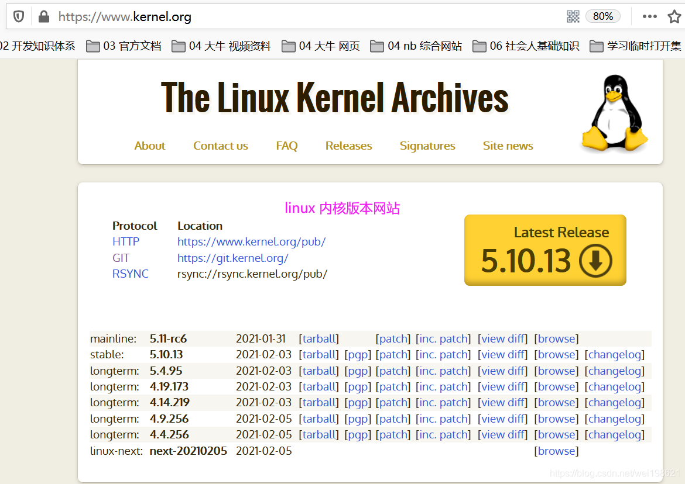当前最新是 5.10 版的内核

### P004\_韩顺平图解Linux全面升级\_Linux与Unix 18:09

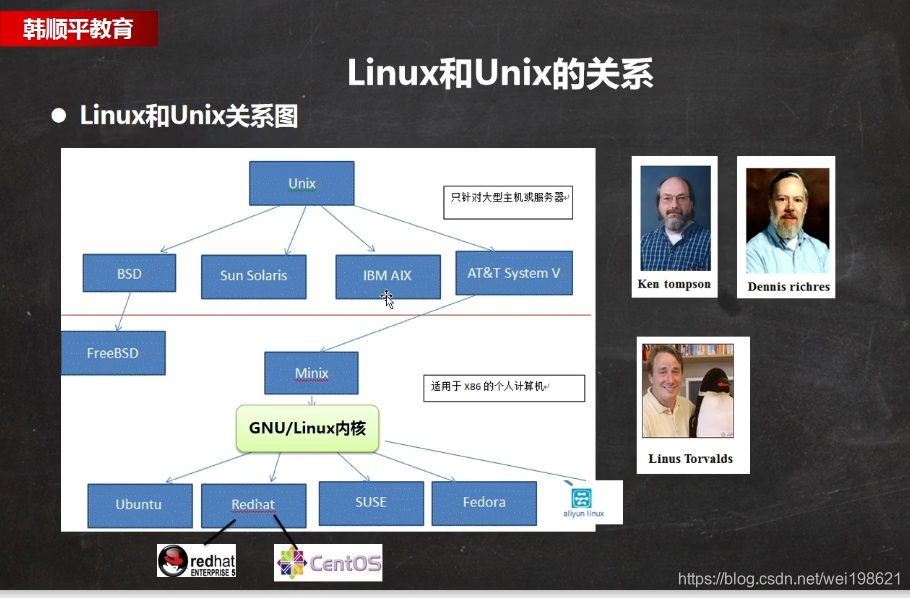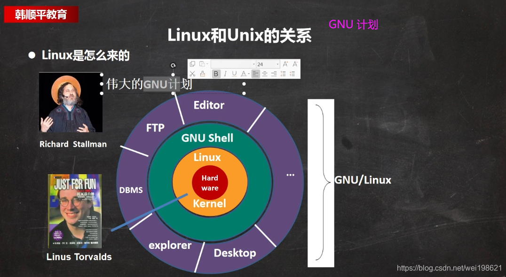

## 第三章 vm 和 linux 安装

### P005\_韩顺平图解Linux全面升级\_vmware15.5安装 17:36

下载官方地址： https://www.[vmware](https://so.csdn.net/so/search?q=vmware&spm=1001.2101.3001.7020).com/cn.html  
下载好用地址： https://www.nocmd.com/windows/740.html

### P006\_韩顺平图解Linux全面升级\_CentOS7.6安装 35:15

https://mirrors.163.com/centos  
https://mirrors.aliyun.com/centos ----不可用

### P007\_韩顺平图解Linux全面升级\_网络连接三种方式 16:01

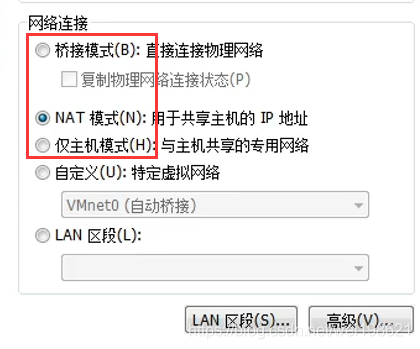

网络连接的三种模式  
模式1.桥接模式  
虚拟系统可以和外部系统通讯，但是容易造成IP冲突

模式2.NAT模式  
网络地址转换模式，虚拟系统可以和外部通讯，不造成IP冲突；  
注意外部不可以访问内部

模式3.主机模式  
独立的系统，不与外部联系

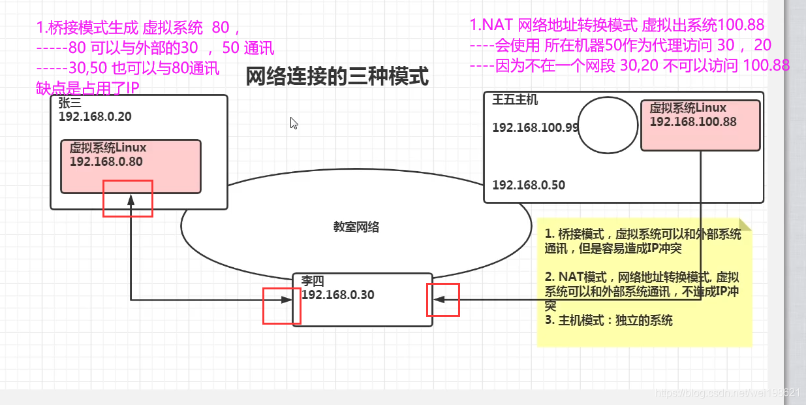

### P008\_韩顺平图解Linux全面升级\_虚拟机克隆 09:13

### P009\_韩顺平图解Linux全面升级\_虚拟机快照 09:15

### P010\_韩顺平图解Linux全面升级\_虚拟机迁移删除 06:47

### P011\_韩顺平图解Linux全面升级\_vmtools 20:39

gcc -v ： 可以查看是否有安装gcc  
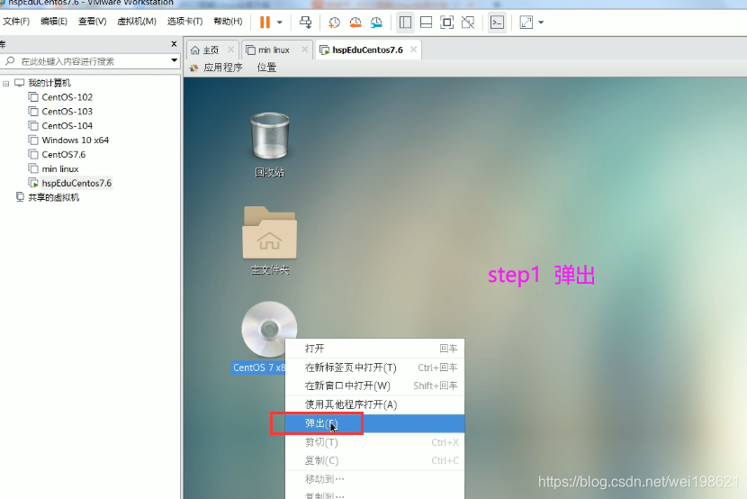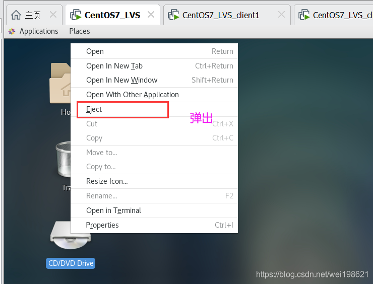

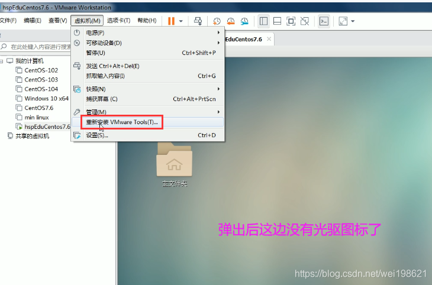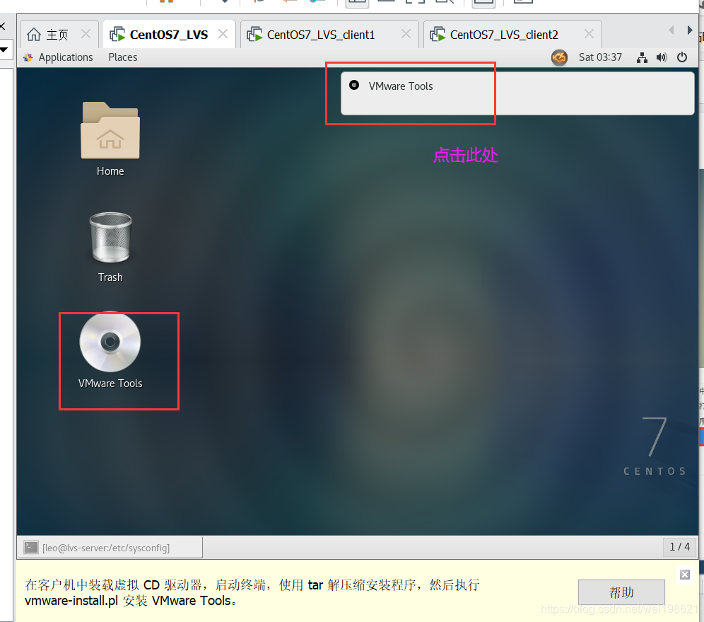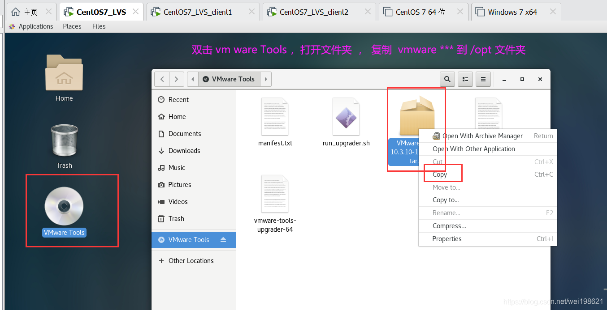将其放到 /opt 目录

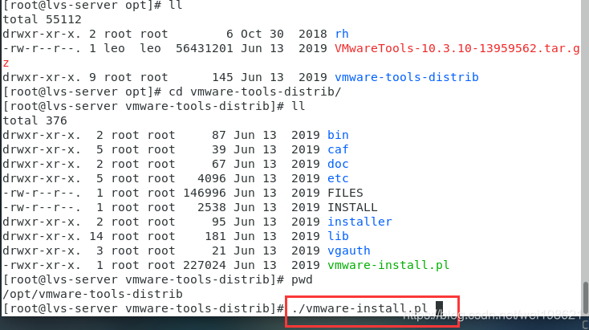  
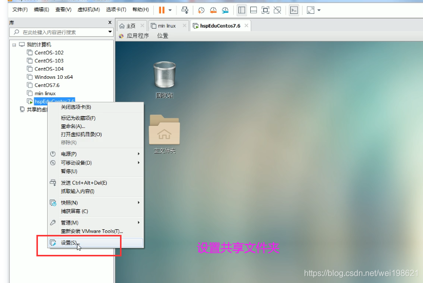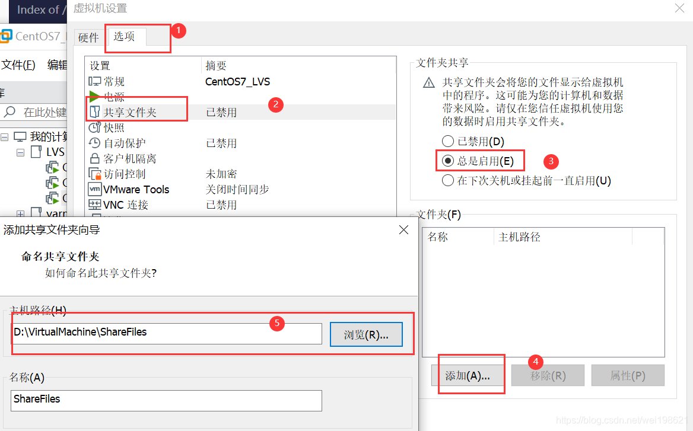  
/mnt/hgfs/  
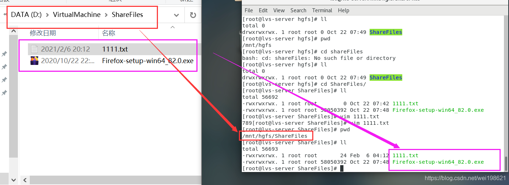

## 第四章 linux 目录结构

### P012\_韩顺平图解Linux全面升级\_目录结构介绍 07:50

### P013\_韩顺平图解Linux全面升级\_目录结构详解 18:44

## 第五章 linux 实操篇 远程登录

### P014\_韩顺平图解Linux全面升级\_远程登录 15:30

下载 free - for home school 版本 地址  
https://www.netsarang.com/en/free-for-home-school/  
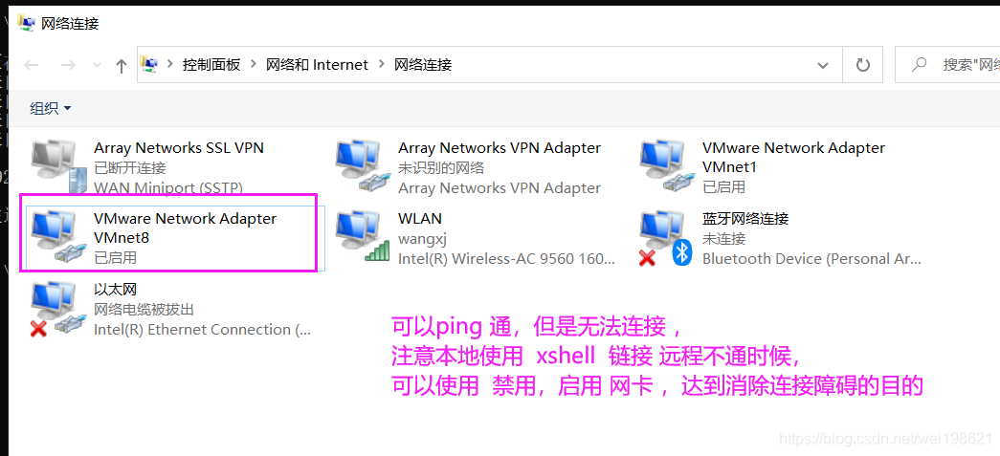

### P015\_韩顺平图解Linux全面升级\_远程文件传输 13:58

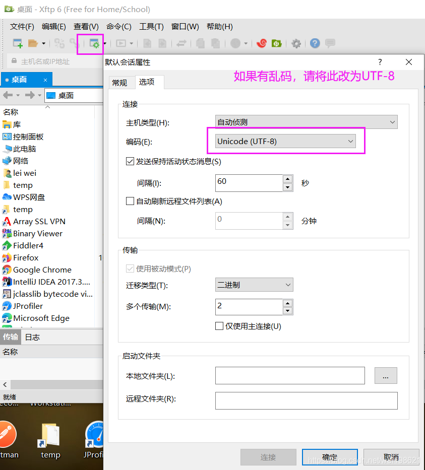

## 第六章 linux 实操篇 vi和vim

### P016\_韩顺平图解Linux全面升级\_vi vim快速入门 08:32

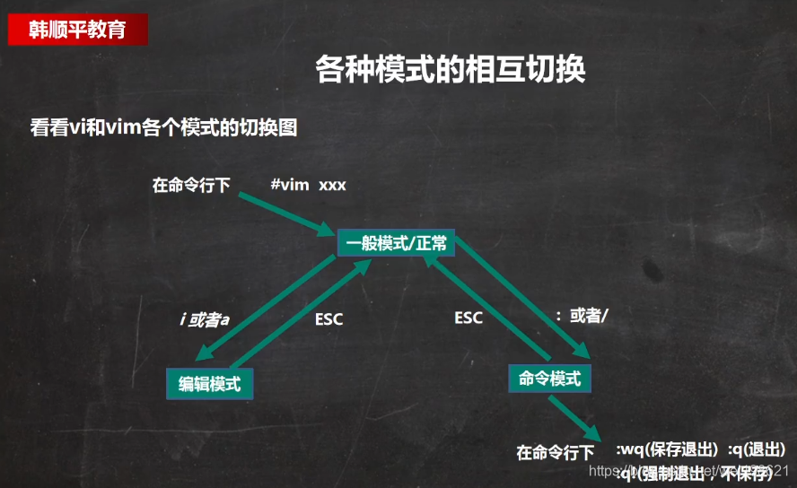

### P017\_韩顺平图解Linux全面升级\_vi vim快捷键 19:09

VIM快捷键使用

执行动作

所在模式

具体快捷键操作

1.拷贝

一般模式

拷贝当前行== yy ； 拷贝当前行向下5行 ==5yy ; 黏贴用 p

2\. 删除

一般模式

删除当前行 dd ; 删除当前行向下5行 5dd

3.文件中查找

一般模式 、命令行模式

/关键字 ； 回车 查找； n 下一个；

4\. 设置行号

命令行模式

:set nu ; :set nonu ;

5\. 撤销

一般模式

u = 撤销

6\. 快速定位

一般模式

gg=首行 ； G = 末行 ；

7.快速定位某行

一般模式

20 ， shift + g == 快速定位到20行

### P018\_韩顺平图解Linux全面升级\_vi vim内容梳理 06:02

## 第七章 linux 实操篇 开机 重启

### P019\_韩顺平图解Linux全面升级\_关机重启 07:54

关机&重启命令

执行动作

所在模式

shutdown -h now

立刻进行关机

shutdown

1分钟后会关机(等同下面)

shutdown -h 1

1分钟后会关机

shutdown -r now

现在重新启动计算机

halt

关机，作用和上面一样

reboot

现在重新启动计算机

sync

将内存数据同步到磁盘

### P020\_韩顺平图解Linux全面升级\_登录注销 08:41

1.  开始以tom身份登录
2.  su root 切换到root 用户
3.  执行相关操作
4.  在root 用户下 ，执行 logout 指令， 切换回tom 用户
5.  在tom用户下，再次执行logout 退出

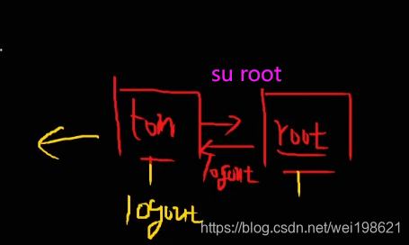  
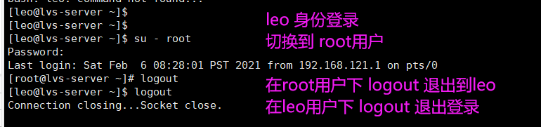

## 第八章 linux实操篇 用户管理

20210207

### P021\_韩顺平图解Linux全面升级\_用户管理(1) 15:26

https://www.bilibili.com/video/BV1Sv411r7vd?p=21  
20210317 继续

–新建用户 设置密码

    ----- useradd milan ;默认创建家目录 /home/milan
    [root@shell37 home]# useradd milan     ----新增用户milan 
    
    [root@shell37 home]# passwd milan    --给milan设置密码  
    Changing password for user milan.
    New password: 
    BAD PASSWORD: The password is shorter than 8 characters
    Retype new password: 
    passwd: all authentication tokens updated successfully.

​    

    --- 显示所有用户 
     cat /etc/passwd | awk -F: '$3>=500' | cut -f 1 -d :
    输出/etc/passwd文件，对于每一行进行处理，判断以冒号:分割的第三个元素，抽取其中的大于500的行，并用cut输出第一列（用户账号名）。
    
    删除用户 king  ---保留家目录
     userdel king 
     [root@shell37 home]# pwd
    /home
    [root@shell37 home]# ls
    kinghome  leo  milan
    
    --- 删除用户 milan  不保留家目录 （要慎重操作）
    [root@shell37 home]# pwd
    /home
    [root@shell37 home]# ls
    kinghome  leo  milan
    [root@shell37 home]# userdel -r milan
    [root@shell37 home]# ls
    kinghome  leo

​    
​    

### P022\_韩顺平图解Linux全面升级\_用户管理(2) 05:22

    [root@shell37 home]# id leo
    uid=1000(leo) gid=1000(leo) groups=1000(leo)
    [root@shell37 home]# id root
    uid=0(root) gid=0(root) groups=0(root)
    [root@shell37 home]# id milan
    id: milan: no such user

    [root@shell37 home]# useradd jack
    [root@shell37 home]# passwd jack
    Changing password for user jack.
    New password: 
    BAD PASSWORD: The password is shorter than 8 characters
    Retype new password: 
    passwd: all authentication tokens updated successfully.
    [root@shell37 home]# su - jack
    [jack@shell37 ~]$ 
    [jack@shell37 ~]$ pwd
    /home/jack
    [jack@shell37 ~]$ su - root
    Password: 
    Last login: Wed Mar 17 06:58:33 PDT 2021 on pts/0
    [root@shell37 ~]# logout
    [jack@shell37 ~]$ logout

    [root@shell37 ~]# whoami
    root
    [root@shell37 ~]# who am i
    root     pts/0        2021-03-17 07:12 (192.168.121.1)
    [root@shell37 ~]# su - jack
    Last login: Wed Mar 17 07:11:14 PDT 2021 on pts/0
    [jack@shell37 ~]$ who am i
    root     pts/0        2021-03-17 07:12 (192.168.121.1)

### P023\_韩顺平图解Linux全面升级\_用户管理(3) 18:45

    [root@shell37 ~]# groupadd wudang   ---武当 
    [root@shell37 ~]# useradd -g wudang zwj
    [root@shell37 ~]# id zwj  ---张无忌 
    uid=1002(zwj) gid=1003(wudang) groups=1003(wudang)
    
    ---- 张无忌 划归 魔教 门下
    [root@shell37 ~]# groupadd mojiao
    [root@shell37 ~]# usermod -g mojiao zwj
    [root@shell37 ~]# id zwj
    uid=1002(zwj) gid=1004(mojiao) groups=1004(mojiao)

    [root@shell37 ~]# cat /etc/passwd
    ...
    tcpdump:x:72:72::/:/sbin/nologin
    leo:x:1000:1000:CentOS7:/home/leo:/bin/bash
    mongod:x:987:981:mongod:/var/lib/mongo:/bin/false
    jack:x:1001:1001::/home/jack:/bin/bash
    zwj:x:1002:1004::/home/zwj:/bin/bash
    
    [root@shell37 ~]# cat /etc/shadow
    tcpdump:!!:18557::::::
    leo:$1$oxzRhXx2$3.4d0qInl.vMfZJCW25Pi1:18557:0:99999:7:::
    mongod:!!:18581::::::
    jack:$1$naZ6CVhI$OEJlUnnEECkDCXfhTKEIe0:18703:0:99999:7:::    ---设置过密码的
    zwj:!!:18703:0:99999:7:::                                      -- zwj 没有设置密码，所以没有数据是！！
    
    [root@shell37 ~]# cat /etc/group
    .....
    tcpdump:x:72:
    leo:x:1000:
    mongod:x:981:
    docker:x:980:
    jack:x:1001:
    wudang:x:1003:
    mojiao:x:1004:

​    

### P024\_韩顺平图解Linux全面升级\_用户管理(4) 08:37

## 第九章 Linux 实操篇 使用指令

### P025\_韩顺平图解Linux全面升级\_运行级别 12:03

    [root@shell37 bin]# init 5   --- 切换到图形界面 
    [root@shell37 bin]# 
    [root@shell37 bin]# init 3   --- 切换到命令行界面 

    [root@shell37 bin]# systemctl get-default
    graphical.target
    
    [root@shell37 bin]# systemctl set-default multi-user.target 
    Removed symlink /etc/systemd/system/default.target.
    Created symlink from /etc/systemd/system/default.target to /usr/lib/systemd/system/multi-user.target.
    
    [root@shell37 bin]# systemctl get-default
    multi-user.target

​    

### P026\_韩顺平图解Linux全面升级\_找回root密码 08:23

  
详细图示过程，见单独的文章  
https://blog.csdn.net/wei198621/article/details/114956502

> 具体步骤  
> 1.首先进入系统，进入开机界面，选中 上面的系统，按e进入编辑界面 （默认5秒内操作好，来回切换系统不耗费时间）  
> 2.进入编辑页面，将光标移动到“Linux16” 开头的行，在最后面输入 init=/bin/sh ，输入完成后按ctrl +x 键 进入单用户模式  
> 4.进入单用户模式后，启动如图， 输入 mount -o remount,rw /  
> 注意单词间空格（mount空格-o空格remount,rw空格/ ），然后回车  
> 5.在新的一行后面输入 passwd , 然后回车，  
> 输入密码  
> 再次输入密码  
> 6.此处输入 touch /.autorelabel (touch空格/.autorelabel) 完成后回车  
> 7.输入 exec /sbin/init (exec空格/sbin/init) 然后回车  
> 8.等待重启

### P027\_韩顺平图解Linux全面升级\_帮助指令 08:46

### P028\_韩顺平图解Linux全面升级\_文件目录指令(1) 15:27

### P029\_韩顺平图解Linux全面升级\_文件目录指令(2) 07:33

### P030\_韩顺平图解Linux全面升级\_文件目录指令(3) 12:43

### P031\_韩顺平图解Linux全面升级\_文件目录指令(4) 14:04

### P032\_韩顺平图解Linux全面升级\_文件目录指令(5) 24:21

    [root@hell39 ~]# head -n 5 anaconda-ks.cfg 
    #version=DEVEL
    # System authorization information
    auth --useshadow --enablemd5
    # Install OS instead of upgrade
    install
     
    [root@hell39 ~]# tail -n 5 anaconda-ks.cfg 
    %end
    
    %addon com_redhat_kdump --enable --reserve-mb='auto'

​    
​    

### P033\_韩顺平图解Linux全面升级\_文件目录指令(6) 10:08

    [root@hell39 home]# ln -s /root/ myroot
    [root@hell39 home]# ll
    total 4
    drwxr-xr-x.  2 root root   50 Mar 14 01:31 ceshi
    drwxr-xr-x.  2 root root   25 Mar 14 06:32 docker-test-volume
    drwx------. 15 leo  leo  4096 Dec 15 06:59 leo
    drwxr-xr-x.  2 root root   60 Mar 14 07:53 mydockerfile
    lrwxrwxrwx.  1 root root    6 Mar 17 09:52 myroot -> /root/
    
    [root@hell39 home]# cd myroot/
    [root@hell39 myroot]# pwd
    /home/myroot
    [root@hell39 myroot]# ll
    total 16
    -rw-r--r--. 1 root root    0 Mar 13 22:54 a124.txt
    -rw-------. 1 root root 2761 Oct 22 08:55 anaconda-ks.cfg
    drwxr-xr-x. 4 root root 4096 Nov 18 08:40 data
    drwxr-xr-x. 2 root root    6 Dec  5 03:22 Desktop
    drwxr-xr-x. 2 root root    6 Dec  5 03:22 Documents
    drwxr-xr-x. 2 root root    6 Dec  5 03:22 Downloads
    drwxr-xr-x. 2 root root    6 Dec  5 03:22 Music
    -rw-r--r--. 1 root root  139 Mar 17 09:47 mycal.txt
    -rw-------. 1 root root 2041 Oct 22 08:54 original-ks.cfg
    drwxr-xr-x. 2 root root    6 Dec  5 03:22 Pictures
    drwxr-xr-x. 2 root root    6 Dec  5 03:22 Public
    drwxr-xr-x. 2 root root    6 Dec  5 03:22 Templates
    drwxr-xr-x. 2 root root    6 Dec  5 03:22 Videos

​    

    [root@hell39 myroot]# history 10
      728  link -s /root/ myroot
      729  clear
      730  ln -s /root/ myroot
      731  ll
      732  cd myroot/
      733  pwd
      734  ll
      735  history
      736  history --help
      737  history 10
    
    [root@hell39 myroot]# !733
    pwd
    /home/myroot
    [root@hell39 myroot]# 

### P034\_韩顺平图解Linux全面升级\_时间日期指令 07:514

20210318  

    [root@shell37 ~]# date +%y
    21
    [root@shell37 ~]# date +%Y
    2021
    [root@shell37 ~]# date +%m
    03
    [root@shell37 ~]# date +%d
    18
    [root@shell37 ~]# date "+%Y-%m-%d %H:%M:%S"
    2021-03-18 06:50:04

### P035\_韩顺平图解Linux全面升级\_查找指令(1) 13:33

     [root@shell37 shell]# find /opt -size +200M
     [root@shell37 shell]# find -name time.sh
    ./time.sh

​    
​    [root@shell37 shell]# updatedb
​    [root@shell37 shell]# locate time.sh
​    /opt/shell/time.sh

​    
​    [root@shell37 shell]# which ls
​    alias ls='ls --color=auto'
​            /usr/bin/ls
​    [root@shell37 shell]# which reboot
​    /usr/sbin/reboot

### P036\_韩顺平图解Linux全面升级\_查找指令(2) 08:22

    [root@shell37 shell]# cat time.sh | grep sleep
      sleep 1
    [root@shell37 shell]# cat -n time.sh | grep sleep
         4    sleep 1
    [root@shell37 shell]# cat time.sh | grep -n sleep
    4:  sleep 1
    [root@shell37 shell]# grep -n "sleep" ./
    grep: ./: Is a directory
    [root@shell37 shell]# grep -n "sleep"  time.sh
    4:  sleep 1

### P037\_韩顺平图解Linux全面升级\_压缩和解压(1) 11:18

    [root@shell37 shell2]# ll
    total 6368
    drwxr-xr-x. 4 root root    4096 Mar 18 22:29 shell
    -rw-r--r--. 1 root root 6510585 Mar 18 22:28 shell2.zip
    -rw-r--r--. 1 root root      46 Mar 18 22:30 whiletest.sh
    [root@shell37 shell2]# gzip whiletest.sh 
    [root@shell37 shell2]# ll
    total 6368
    drwxr-xr-x. 4 root root    4096 Mar 18 22:29 shell
    -rw-r--r--. 1 root root 6510585 Mar 18 22:28 shell2.zip
    -rw-r--r--. 1 root root      75 Mar 18 22:30 whiletest.sh.gz
    [root@shell37 shell2]# gunzip whiletest.sh.gz 
    [root@shell37 shell2]# ll
    total 6368
    drwxr-xr-x. 4 root root    4096 Mar 18 22:29 shell
    -rw-r--r--. 1 root root 6510585 Mar 18 22:28 shell2.zip
    -rw-r--r--. 1 root root      46 Mar 18 22:30 whiletest.sh

​    
​    [root@shell37 shell2]# ll
​    total 6364
​    drwxr-xr-x. 4 root root    4096 Mar  9 07:22 shell
​    -rw-r--r--. 1 root root 6510585 Mar 18 22:28 shell2.zip
​    
    [root@shell37 shell2]# zip -r shell2.zip ./shell/
    
    [root@shell37 shell2]# ll
    total 6364
    drwxr-xr-x. 4 root root    4096 Mar  9 07:22 shell
    -rw-r--r--. 1 root root 6510585 Mar 18 22:28 shell2.zip

### P038\_韩顺平图解Linux全面升级\_压缩和解压(2) 09:59

    [root@shell37 shell2]# ll
    total 6368
    drwxr-xr-x. 4 root root    4096 Mar 18 22:29 shell
    -rw-r--r--. 1 root root 6510585 Mar 18 22:28 shell2.zip
    -rw-r--r--. 1 root root      46 Mar 18 22:30 whiletest.sh
    [root@shell37 shell2]# tar -zcvf  22.tar.gz whiletest.sh 
    whiletest.sh
    [root@shell37 shell2]# ll
    total 6372
    -rw-r--r--. 1 root root     158 Mar 18 22:36 22.tar.gz
    drwxr-xr-x. 4 root root    4096 Mar 18 22:29 shell
    -rw-r--r--. 1 root root 6510585 Mar 18 22:28 shell2.zip
    -rw-r--r--. 1 root root      46 Mar 18 22:30 whiletest.sh
    
    [root@shell37 shell2]# tar -zxvf 22.tar.gz 
    whiletest.sh
    ---将*** 解压到文件夹  shell2dir 下面 
    [root@shell37 shell2]# tar -zxvf 22.tar.gz -C shell2dir/
    whiletest.sh

### P039\_韩顺平图解Linux全面升级\_实用指令小结 04:57

## 第十章 Linux实操篇 组管理和权限管理

### P040\_韩顺平图解Linux全面升级\_linux组的介绍 07:35

### P041\_韩顺平图解Linux全面升级\_所有者 04:03

    [root@shell37 home]# ls -ahl
    total 8.0K
    drwxr-xr-x.  6 root root     56 Mar 17 07:20 .
    dr-xr-xr-x. 19 root root   4.0K Mar 16 07:51 ..
    drwx------.  5 jack jack    128 Mar 17 07:11 jack
    drwx------.  3 zwj    1002   78 Mar 17 06:52 kinghome
    drwx------. 15 leo  leo    4.0K Dec 15 06:59 leo
    drwx------.  3 zwj  mojiao   78 Mar 17 07:20 zwj
    [root@shell37 home]# chown leo zwj
    [root@shell37 home]# ls -ahl
    total 8.0K
    drwxr-xr-x.  6 root root     56 Mar 17 07:20 .
    dr-xr-xr-x. 19 root root   4.0K Mar 16 07:51 ..
    drwx------.  5 jack jack    128 Mar 17 07:11 jack
    drwx------.  3 zwj    1002   78 Mar 17 06:52 kinghome
    drwx------. 15 leo  leo    4.0K Dec 15 06:59 leo
    drwx------.  3 leo  mojiao   78 Mar 17 07:20 zwj

### P042\_韩顺平图解Linux全面升级\_所在组 08:56

    [root@shell37 home]# groupadd monster
    [root@shell37 home]# useradd -g monster fox
    [root@shell37 home]# id fox
    uid=1003(fox) gid=1005(monster) groups=1005(monster)
    [root@shell37 home]# 

​    
​    [fox@shell37 ~]$ pwd
​    /home/fox
​    [fox@shell37 ~]$ touch ok.txt
​    [fox@shell37 ~]$ ll
​    total 0
​    -rw-r--r--. 1 fox monster 0 Mar 18 23:04 ok.txt
​    [fox@shell37 ~]$ 
​    
    [root@shell37 ~]# clear
    [root@shell37 ~]# groupadd fruit
    [root@shell37 ~]# touch orange.txt
    [root@shell37 ~]# ll
    [root@shell37 ~]# chgrp fruit orange.txt 
    [root@shell37 ~]# ll

### P043\_韩顺平图解Linux全面升级\_修改所在组 04:15

    [root@shell37 ~]# clear
    [root@shell37 ~]# id zwj
    uid=1002(zwj) gid=1004(mojiao) groups=1004(mojiao)
    [root@shell37 ~]# cat /etc/group
    
    [root@shell37 ~]# cat /etc/group | grep wudang
    wudang:x:1003:
    [root@shell37 ~]# usermod -g wudang zwj
    [root@shell37 ~]# id zwj
    uid=1002(zwj) gid=1003(wudang) groups=1003(wudang)

### P044\_韩顺平图解Linux全面升级\_rwx权限 15:46

### P045\_韩顺平图解Linux全面升级\_权限说明案例 06:48

    [root@shell38 dev]# ll /dev
    total 0
    crw-rw----. 1 root video    10, 175 Mar 18 06:45 agpgart
    crw-------. 1 root root     10, 235 Mar 18 06:45 autofs
    drwxr-xr-x. 2 root root         140 Mar 18 06:45 block

### P046\_韩顺平图解Linux全面升级\_修改权限 09:32

    -rwxrw---x. 1 root root   46 Mar  6 00:56 whiletest.sh
    [root@shell37 shell]# chmod u=rwx,g=rw,o=x whiletest.sh 

### P047\_韩顺平图解Linux全面升级\_修改所有者和所在组 09:15

chown tom /home/test2.txt  
chown -R tom /home/test  
chgrp newgroup 文件/目录  

### P048\_韩顺平图解Linux全面升级\_权限管理应用实例(1) 21:57

### P049\_韩顺平图解Linux全面升级\_权限管理应用实例(2) 17:43

### P050\_韩顺平图解Linux全面升级\_权限管理应用实例(3) 09:50

目录 rwx 权限

x: 可以进入到该目，cd 到该目录  
r: 是否可以在目录下执行 ll 读取目录下的数据  
w: 执行更改 ，删除操作

### P051\_韩顺平图解Linux全面升级\_权限管理应用实例(4) 14:34

梳理知识点

## 第十一章 定时任务调度

### P052\_韩顺平图解Linux全面升级\_crond快速入门 11:01

crontab  

### P053\_韩顺平图解Linux全面升级\_crond时间规则 05:05

### P054\_韩顺平图解Linux全面升级\_crond应用实例 14:55

### P055\_韩顺平图解Linux全面升级\_at任务调度机制 12:36

at 定时任务  

### P056\_韩顺平图解Linux全面升级\_at任务调度实例 10:09

### P057\_韩顺平图解Linux全面升级\_任务调度小结 09:49

    crontab   定时任务调度
    crontab  -e / -l  / -r  
    service crond restart 
    
    at 定时任务
    at ****  
    Ctrl + D  两次  结束at命令的输入
    很多种时间定义，用时候再找，没有必要学
    atq  ；   --------- 查看有没有at   
    atrm  编号；   ----- 删除某个at队列

## 第十二章 linux磁盘分区、挂载

### P058\_韩顺平图解Linux全面升级\_磁盘分区机制 16:04

lsblk ---- list block  

    [root@shell37 ~]# lsblk
    NAME   MAJ:MIN RM  SIZE RO TYPE MOUNTPOINT
    sda      8:0    0   20G  0 disk 
    ├─sda1   8:1    0  300M  0 part /boot
    ├─sda2   8:2    0    2G  0 part [SWAP]
    └─sda3   8:3    0 17.7G  0 part /
    sr0     11:0    1 1024M  0 rom  
    [root@shell37 ~]# lsblk -f
    NAME   FSTYPE LABEL UUID                                 MOUNTPOINT
    sda                                                      
    ├─sda1 xfs          8786eecf-a821-4cbe-9487-c1928e125036 /boot
    ├─sda2 swap         fc0a630f-5a4d-4489-b58f-d9e652a8d69e [SWAP]
    └─sda3 xfs          dd082c19-0431-4fce-9c8d-b84dca3dfad5 /
    sr0                                                      
    [root@shell37 ~]# 

### P059\_韩顺平图解Linux全面升级\_增加磁盘应用实例 23:02

linux vm 虚拟机挂载硬盘  
内容比较多，详见单独文章  
https://blog.csdn.net/wei198621/article/details/115023640

    ---- 查看对应关系
    [root@shell37 dev]# lsblk 
    NAME   MAJ:MIN RM  SIZE RO TYPE MOUNTPOINT
    sda      8:0    0   20G  0 disk 
    ├─sda1   8:1    0  300M  0 part /boot
    ├─sda2   8:2    0    2G  0 part [SWAP]
    └─sda3   8:3    0 17.7G  0 part /
    sdb      8:16   0    1G  0 disk 
    └─sdb2   8:18   0 1023M  0 part   ------看到 sdb2已经创建 

​    

### P060\_韩顺平图解Linux全面升级\_磁盘情况查询 07:57

    [root@shell37 ~]# df -h
    Filesystem      Size  Used Avail Use% Mounted on
    /dev/sda3        18G   12G  6.5G  64% /
    devtmpfs        471M     0  471M   0% /dev
    tmpfs           487M     0  487M   0% /dev/shm
    tmpfs           487M  8.1M  479M   2% /run
    tmpfs           487M     0  487M   0% /sys/fs/cgroup
    /dev/sdb2       991M  2.6M  922M   1% /newdisk
    /dev/sda1       297M  147M  151M  50% /boot
    tmpfs            98M     0   98M   0% /run/user/0
    [root@shell37 ~]# 

  
最简单的 du 指令是 du /opt ,常用的 要加上 --max-depth 参数

    [root@shell37 opt]# du --max-depth=1 /opt
    0       /opt/rh
    660332  /opt/software
    20688   /opt/shell
    8       /opt/schwing
    0       /opt/containerd
    0       /opt/schwing-web
    0       /opt/schwing-web-log
    16164   /opt/idea
    14192   /opt/shell2
    0       /opt/shell20210319
    717752  /opt

    [root@shell37 opt]# du -hac --max-depth=1 /opt
    0       /opt/rh
    645M    /opt/software
    21M     /opt/shell
    8.0K    /opt/schwing
    0       /opt/containerd
    0       /opt/schwing-web
    0       /opt/schwing-web-log
    16M     /opt/idea
    4.0K    /opt/time.sh
    6.3M    /opt/myshell.zip
    14M     /opt/shell2
    0       /opt/shell20210319
    4.0K    /opt/cron.txt
    701M    /opt
    701M    total

### P061\_韩顺平图解Linux全面升级\_磁盘实用指令 07:24

    ----- 显示所有的 /opt 目录下 （一级）文件 文件夹  
    [root@shell37 opt]# ls -l /opt
    total 6372
    drwx--x--x. 4 root root      28 Mar 12 18:43 containerd
    -rw-r--r--. 1 root root     716 Mar 19 21:16 cron.txt
    drwxr-xr-x. 2 root root      66 Mar 16 09:16 idea
    -rw-r--r--. 1 root root 6510585 Mar 18 22:24 myshell.zip
    drwxr-xr-x. 2 root root       6 Oct 30  2018 rh
    drwxr-xr-x. 2 root root      72 Mar 12 21:44 schwing
    drwxr-xr-x. 6 root root     100 Mar 12 20:31 schwing-web
    drwxr-xr-x. 2 root root       6 Mar 12 20:31 schwing-web-log
    drwxr-xr-x. 4 root root    4096 Mar  9 07:22 shell
    drwxr-xr-x. 4 root root      91 Mar 18 22:42 shell2
    drwxr-xr-x. 2 root root       6 Mar 19 05:56 shell20210319
    drwxr-xr-x. 4 root root     282 Mar  5 06:16 software
    -rw-r--r--. 1 root root      83 Mar 18 22:18 time.sh
    
    ------ 显示 /opt 目录下 (以-开头的)文件  
    [root@shell37 opt]# ls -l /opt| grep "^-"
    -rw-r--r--. 1 root root     716 Mar 19 21:17 cron.txt
    -rw-r--r--. 1 root root 6510585 Mar 18 22:24 myshell.zip
    -rw-r--r--. 1 root root      83 Mar 18 22:18 time.sh
    
    ------列出 /opt 目录下 (以-开头的)文件  的个数 
    [root@shell37 opt]# ls -l /opt| grep "^-" | wc -l
    3
    
    ------列出 /opt 目录下 (以d开头的)文件夹  的个数 
    [root@shell37 opt]# ls -l /opt| grep "^d" | wc -l
    10
    
    ------递归列出所有  /opt 目录下 (以-开头的)文件  的个数 
    [root@shell37 opt]# ls -lR /opt| grep "^-" | wc -l
    2512
    
    ------递归列出所有  /opt 目录下 (以d开头的)文件夹  的个数 
    [root@shell37 opt]# ls -lR /opt| grep "^d" | wc -l
    269

tree 默认没有安装

    [root@shell37 opt]# tree --help
    bash: tree: command not found...
    [root@shell37 opt]#
    [root@shell37 opt]# yum install -y tree
    Loaded plugins: fastestmirror, langpacks
    Loading mirror speeds from cached hostfile
     * base: mirrors.aliyun.com
     * extras: mirrors.aliyun.com
    
    [root@shell37 opt]# tree -L 1 /opt
    /opt
    ├── containerd
    ├── cron.txt
    ├── idea
    ├── myshell.zip
    ├── rh
    ├── schwing
    ├── schwing-web
    ├── schwing-web-log
    ├── shell
    ├── shell2
    ├── shell20210319
    ├── software
    └── time.sh

### P062\_韩顺平图解Linux全面升级\_磁盘分区挂载小结 10:30

    lsblk 
    lsblk -f 
    
    fdisk /dev/sdb
    ---格式化
    mkfs -t ext4 /dev/sdb1
    -----挂载 
    mount /dev/sdb1 /newdisk 
    -----卸载
    umount  /dev/sdb1
    -----注意命令挂载，重启后分区失效
    ---- 编辑 /et/fstab   让挂载永久生效
    -----磁盘整体情况查询
    df  -h    
    -----目录情况查询
    du   -hac  --max-depth /opt 
    ---工作几个使用的查询磁盘使用情况语句
    tree  默认centOS 没有安装，需要安装后使用
    yum install -y tree 
    tree -L 2 /opt 

​    

## 第十三章 网络配置

### P063\_韩顺平图解Linux全面升级\_NAT网络原理图 13:42

vmware 上面的192.168.121.37 地址

    [root@shell37 opt]# ifconfig
    ens33: flags=4163<UP,BROADCAST,RUNNING,MULTICAST>  mtu 1500
            inet 192.168.121.37  netmask 255.255.255.0  broadcast 192.168.121.255
            inet6 fe80::a2cd:d26a:151d:8896  prefixlen 64  scopeid 0x20<link>
            ether 00:0c:29:b0:37:c7  txqueuelen 1000  (Ethernet)
            RX packets 6951  bytes 7719128 (7.3 MiB)
            RX errors 0  dropped 0  overruns 0  frame 0
            TX packets 2287  bytes 352213 (343.9 KiB)
            TX errors 0  dropped 0 overruns 0  carrier 0  collisions 0

    --------本机ipconfig 后显示  VMnet8  
    以太网适配器 VMware Network Adapter VMnet8:
    
       连接特定的 DNS 后缀 . . . . . . . :
       本地链接 IPv6 地址. . . . . . . . : fe80::d8ca:d064:1bb2:f289%10
       IPv4 地址 . . . . . . . . . . . . : 192.168.121.1
       子网掩码  . . . . . . . . . . . . : 255.255.255.0
       默认网关. . . . . . . . . . . . . :

  

### P064\_韩顺平图解Linux全面升级\_网络配置指令 07:16

### P065\_韩顺平图解Linux全面升级\_网络配置实例 12:10

    [root@shell37 opt]# vim /etc/sysconfig/network-scripts/ifcfg-ens33
    service network start
    reboot

​    

### P066\_韩顺平图解Linux全面升级\_主机名和hosts映射 22:08

设置主机名  

    ----显示主机名  
    [root@shell37 opt]# hostname
    shell37
    [root@shell37 opt]# cat /etc/hostname
    shell37

设置host映射  

    windos:  c:\Windows\System32\drivers\etc\hosts 
    linux:  /etc/hosts

> 域名解析过程  
> 1.浏览器缓存  
> 2.本地计算机中的DNS缓存 ipconfig /displaydns 可以查看  
> 3\. hosts文件中的 ip 域名 对应关系  
> 4.外网真正的DNS服务器

    ----显示本地DNS缓存
    C:\Users\wei19>ipconfig /displaydns

​    

### P067\_韩顺平图解Linux全面升级\_网络配置小结 09:42

    网络配置原理
    查看虚拟机的 IP  网关   等信息
    ping  www.baidu.com
    vim /etc/sysconfig/network-scripts/ifcfg-ens33
    vim /etc/hosts
    C:\Windows\System32\dirvers\etc\hosts
    service network restart
    reboot
    hostnam
    vim /etc/hostname

​    
​    
​    

## 第十四章 进程管理

### P068\_韩顺平图解Linux全面升级\_进程基本介绍 06:22

### P069\_韩顺平图解Linux全面升级\_ps指令详解 ps -aux 10:21

    ps  -aux    ---------  查看系统中正在运行的进程 

    [root@shell37 opt]# ps -aux | grep sshd
    root       4027  0.0  0.0 112708   976 pts/0    S+   01:13   0:00 grep --color=auto sshd
    root       6883  0.0  0.0 112756   716 ?        Ss   Mar19   0:00 /usr/sbin/sshd -D
    root       7924  0.0  0.0 160848   912 ?        Ss   Mar19   0:00 sshd: root@pts/0
    [root@shell37 opt]# 

​    

### P070\_韩顺平图解Linux全面升级\_父子进程 ps -ef 08:21

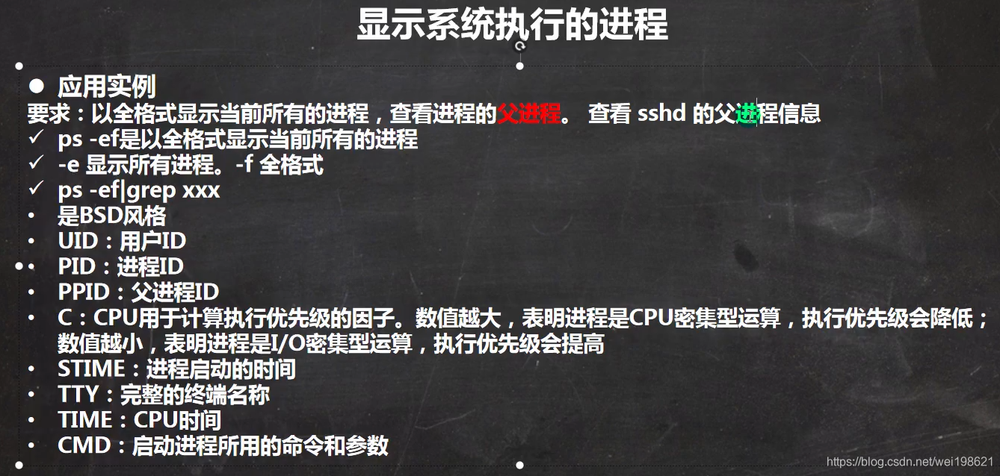ps -ef : 可以看到父进程号

    [root@shell37 opt]# ps -ef|more
    UID         PID   PPID  C STIME TTY          TIME CMD
    root          1      0  0 Mar19 ?        00:00:03 /usr/lib/systemd/systemd --switched-root --system --deserialize 22
    root          2      0  0 Mar19 ?        00:00:00 [kthreadd]
    root          3      2  0 Mar19 ?        00:00:01 [ksoftirqd/0]
    root          5      2  0 Mar19 ?        00:00:00 [kworker/0:0H]
    root          7      2  0 Mar19 ?        00:00:00 [migration/0]

ps -aux 查看某系统进程占用内存 cpu 资源情况

    [root@shell37 opt]# ps -axu|more
    USER        PID %CPU %MEM    VSZ   RSS TTY      STAT START   TIME COMMAND
    root          1  0.0  0.4 193868  4584 ?        Ss   Mar19   0:03 /usr/lib/systemd/systemd --switched-root --system --deserialize 22
    root          2  0.0  0.0      0     0 ?        S    Mar19   0:00 [kthreadd]
    root          3  0.0  0.0      0     0 ?        S    Mar19   0:01 [ksoftirqd/0]
    root          5  0.0  0.0      0     0 ?        S<   Mar19   0:00 [kworker/0:0H]

### P071\_韩顺平图解Linux全面升级\_终止进程 16:15

—开启一个新终端，用 jack2 登录

    [root@shell37 ~]# ssh jack2@192.168.121.37
    jack2@192.168.121.37's password: 
    Last login: Fri Mar 19 06:03:16 2021 from shell37
    [jack2@shell37 ~]$ ll
    total 0
    -rw-r--r--. 1 jack2 police 0 Mar 19 06:04 jack2.txt
    [jack2@shell37 ~]$ 
    
    ---------
    ---------- root  所在terminal 执行 kill 我的登录进程后，我被踢出了
    [jack2@shell37 ~]$ Connection to 192.168.121.37 closed by remote host.
    Connection to 192.168.121.37 closed.

—在原有root 登录的终端，可以看到

    [root@shell37 opt]# ps -ef | grep ssh
    root       6883      1  0 Mar19 ?        00:00:00 /usr/sbin/sshd -D
    root       7924   6883  0 Mar19 ?        00:00:00 sshd: root@pts/0,pts/1
    root      16102  13939  0 01:37 pts/1    00:00:00 ssh jack2@192.168.121.37
    root      16103   6883  0 01:37 ?        00:00:00 sshd: jack2 [priv]  ------------------- 此为jack2 登录的进程 
    jack2     16249  16103  0 01:38 ?        00:00:00 sshd: jack2@pts/2
    root      16559   7943  0 01:38 pts/0    00:00:00 grep --color=auto ssh
    root      61977  61758  0 Mar19 ?        00:00:00 /usr/bin/ssh-agent /bin/sh -c exec -l /bin/bash -c "env GNOME_SHELL_SESSION_MODE=classic gnome-session --session gnome-classic"
    --------kill  16103  后 jack2 被强制退出了
    [root@shell37 opt]# kill 16103

关闭SSH服务，查看效果

    ------6883   为ssh  服务本身，如果杀死，没有办法远程了 ，实际应该是关闭22端口 
    [root@shell37 opt]# ps -axu |grep sshd
    root       6883  0.0  0.0 112756   972 ?        Ss   Mar19   0:00 /usr/sbin/sshd -D
    root       7924  0.0  0.1 160848  1300 ?        Ss   Mar19   0:00 sshd: root@pts/0,pts/1
    root      22879  0.0  0.0 112708   976 pts/0    S+   01:51   0:00 grep --color=auto sshd
    
    ---- 删除后执行登录，提示失败 
    [root@shell37 ~]# ssh root@192.168.121.37
    ssh: connect to host 192.168.121.37 port 22: Connection refused

重新开启服务

    -------- 启动ssh 服务
    [root@shell37 ~]# /bin/systemctl start sshd.service
    [root@shell37 ~]# 
    -----重新连接  
    [root@shell37 ~]# ssh jack2@192.168.121.37
    jack2@192.168.121.37's password: 
    Last login: Sat Mar 20 01:38:08 2021 from shell37
    [jack2@shell37 ~]$ 

killall 演示

    [root@shell37 opt]# killall gedit

  

### P072\_韩顺平图解Linux全面升级\_pstree指令 04:11

    [root@shell37 opt]# pstree
    [root@shell37 opt]# pstree -p  -----显示进程ID 
    [root@shell37 opt]# pstree -u  ---- 显示进程所属用户  

  

### P073\_韩顺平图解Linux全面升级\_服务管理(1) 13:42

后台程序/守护进程/服务  
service 服务名 \[start|stop|restart|reload|status\]  
7.0 以后用 systemctl 替换 service ，还可以使用 service 的程序在 /etc/init.d 目录下

    [root@shell37 init.d]# cd /etc/init.d
    [root@shell37 init.d]# ll
    total 40
    -rw-r--r--. 1 root root 18281 Aug 24  2018 functions
    -rwxr-xr-x. 1 root root  4569 Aug 24  2018 netconsole
    -rwxr-xr-x. 1 root root  7923 Aug 24  2018 network
    -rw-r--r--. 1 root root  1160 Oct 30  2018 README
    [root@shell37 init.d]# service netconsole status
    netconsole module not loaded
    [root@shell37 init.d]# service network status
    Configured devices:
    lo ens33
    Currently active devices:
    lo ens33 virbr0 br-479c90ff8129 br-93809f7c3dbc docker0
    [root@shell37 init.d]# 

    [root@shell37 ~]# service network status
    Configured devices:
    lo ens33
    Currently active devices:
    lo ens33 virbr0 br-479c90ff8129 br-93809f7c3dbc docker0
    [root@shell37 ~]# service network stop
    Stopping network (via systemctl):                          [  OK  ]
    [root@shell37 ~]# 
    
    setup 可以看到所有的服务 

​    

### P074\_韩顺平图解Linux全面升级\_服务管理(2) 06:30

服务的运行级别  
常用的是 3 5 两个运行级别  

    [root@shell37 ~]# systemctl get-default                                                               
    multi-user.target     ----  默认3 级别  
    [root@shell37 ~]# systemctl set-default graphical.target     ------ 修改为5级别 
    Removed symlink /etc/systemd/system/default.target.
    Created symlink from /etc/systemd/system/default.target to /usr/lib/systemd/system/graphical.target.
    [root@shell37 ~]# systemctl get-default    ----再次查看是5 级别  
    graphical.target

### P075\_韩顺平图解Linux全面升级\_服务管理(3) 06:40

    [root@shell37 ~]# chkconfig --list
    
    Note: This output shows SysV services only and does not include native
          systemd services. SysV configuration data might be overridden by native
          systemd configuration.
    
          If you want to list systemd services use 'systemctl list-unit-files'.
          To see services enabled on particular target use
          'systemctl list-dependencies [target]'.
    
    netconsole      0:off   1:off   2:off   3:off   4:off   5:off   6:off
    network         0:off   1:off   2:on    3:on    4:on    5:on    6:off
    [root@shell37 ~]# chkconfig --level 1 network on
    [root@shell37 ~]# chkconfig --list
    
    Note: This output shows SysV services only and does not include native
          systemd services. SysV configuration data might be overridden by native
          systemd configuration.
    
          If you want to list systemd services use 'systemctl list-unit-files'.
          To see services enabled on particular target use
          'systemctl list-dependencies [target]'.
    
    netconsole      0:off   1:off   2:off   3:off   4:off   5:off   6:off
    network         0:off   1:on    2:on    3:on    4:on    5:on    6:off
    [root@shell37 ~]# 

### P076\_韩顺平图解Linux全面升级\_服务管理(4) 22:01

> service 服务名 \[start|stop|restart|status\] 如： service network stop  
> systemctl \[start|stop|restart|status\] 服务名 如：systemctl stop network  
> //

> service 管理的服务在 /etc/init.d — 由于 /etc/init.d 是个链接 init.d -> rc.d/init.d == ls -l rc.d/init.d  
> systemctl 管理的服务在 /usr/lib/systemd/system — ls -l /usr/lib/systemd/system

    [root@shell37 etc]# systemctl is-enabled firewalld
    disabled
     
    [root@shell37 etc]# systemctl status firewalld
    ● firewalld.service - firewalld - dynamic firewall daemon
       Loaded: loaded (/usr/lib/systemd/system/firewalld.service; disabled; vendor preset: enabled)
       Active: inactive (dead)
         Docs: man:firewalld(1)
         
    [root@shell37 etc]# systemctl list-unit-files | grep fire
    firewalld.service                             disabled
    [root@shell37 etc]# systemctl enable firewalld
    Created symlink from /etc/systemd/system/dbus-org.fedoraproject.FirewallD1.service to /usr/lib/systemd/system/firewalld.service.
    Created symlink from /etc/systemd/system/multi-user.target.wants/firewalld.service to /usr/lib/systemd/system/firewalld.service.
    [root@shell37 etc]# systemctl status firewalld
    ● firewalld.service - firewalld - dynamic firewall daemon
       Loaded: loaded (/usr/lib/systemd/system/firewalld.service; enabled; vendor preset: enabled)
       Active: inactive (dead)
         Docs: man:firewalld(1)
    [root@shell37 etc]# systemctl disable firewalld
    Removed symlink /etc/systemd/system/multi-user.target.wants/firewalld.service.
    Removed symlink /etc/systemd/system/dbus-org.fedoraproject.FirewallD1.service.
    [root@shell37 etc]# systemctl is-enabled firewalld
    disabled
    [root@shell37 etc]# systemctl start firewalld
    [root@shell37 etc]# systemctl status firewalld
    ● firewalld.service - firewalld - dynamic firewall daemon
       Loaded: loaded (/usr/lib/systemd/system/firewalld.service; disabled; vendor preset: enabled)
       Active: active (running) since Sat 2021-03-20 06:39:53 PDT; 7s ago
         Docs: man:firewalld(1)
     Main PID: 93179 (firewalld)
        Tasks: 2
       Memory: 30.0M
       CGroup: /system.slice/firewalld.service
               └─93179 /usr/bin/python -Es /usr/sbin/firewalld --nofork --nopid
    
    Mar 20 06:39:51 shell37 systemd[1]: Starting firewalld - dynamic firewall daemon...
    Mar 20 06:39:53 shell37 systemd[1]: Started firewalld - dynamic firewall daemon.

    --- 当37 防火墙开启  无法telnet 到上面去，显示如下所示 
    [root@shell38 ~]# telnet 192.168.121.37 111
    Trying 192.168.121.37...
    telnet: connect to address 192.168.121.37: No route to host
    --- 当37 防火墙关闭  正常连接上 37 111 端口的提示 （比较怪异，接受吧，中年！ ）
    [root@shell38 ~]# telnet 192.168.121.37 111
    Trying 192.168.121.37...
    Connected to 192.168.121.37.
    Escape character is '^]'.

### P077\_韩顺平图解Linux全面升级\_服务管理(5) 07:56

#### 基本信息

基础状态  
192.168.121.37 ---- 被访问机器  
192.168.121.38 ---- 访问的机器

    [root@shell37 ~]# netstat -anp |more
    Active Internet connections (servers and established)
    Proto Recv-Q Send-Q Local Address           Foreign Address         State       PID/Program name    
    tcp        0      0 127.0.0.1:27017         0.0.0.0:*               LISTEN      6964/mongod         
    tcp        0      0 0.0.0.0:111             0.0.0.0:*               LISTEN      1/systemd ----要处理的端口111   
    tcp        0      0 0.0.0.0:6000            0.0.0.0:*               LISTEN      60873/X             
    tcp        0      0 192.168.122.1:53        0.0.0.0:*               LISTEN      7436/dnsmasq    

#### step1 初始状态防火墙关闭，可以访问

    [root@shell37 etc]# systemctl stop firewalld
    [root@shell37 etc]# systemctl status firewalld
    ● firewalld.service - firewalld - dynamic firewall daemon
       Loaded: loaded (/usr/lib/systemd/system/firewalld.service; disabled; vendor preset: enabled)
       Active: inactive (dead) since Sat 2021-03-20 07:14:25 PDT; 5s ago
         Docs: man:firewalld(1)
      Process: 108629 ExecStart=/usr/sbin/firewalld --nofork --nopid $FIREWALLD_ARGS (code=exited, status=0/SUCCESS)
     Main PID: 108629 (code=exited, status=0/SUCCESS)
    
    Mar 20 07:09:36 shell37 systemd[1]: Starting firewalld - dynamic firewall daemon...
    Mar 20 07:09:36 shell37 systemd[1]: Started firewalld - dynamic firewall daemon.
    Mar 20 07:14:24 shell37 systemd[1]: Stopping firewalld - dynamic firewall daemon...
    Mar 20 07:14:25 shell37 systemd[1]: Stopped firewalld - dynamic firewall daemon.
    [root@shell37 etc]#

37 防火墙关闭 ， 38 可以访问

    [root@shell38 ~]# telnet 192.168.121.37 111
    Trying 192.168.121.37...
    Connected to 192.168.121.37.
    Escape character is '^]'.

#### step2 防火墙打开，38不可以访问37

    [root@shell37 etc]# systemctl start firewalld
    [root@shell37 etc]# systemctl status firewalld
    ● firewalld.service - firewalld - dynamic firewall daemon
       Loaded: loaded (/usr/lib/systemd/system/firewalld.service; disabled; vendor preset: enabled)
       Active: active (running) since Sat 2021-03-20 07:18:06 PDT; 2s ago
         Docs: man:firewalld(1)
     Main PID: 113334 (firewalld)
        Tasks: 2
       Memory: 22.1M
       CGroup: /system.slice/firewalld.service
               └─113334 /usr/bin/python -Es /usr/sbin/firewalld --nofork --nopid
    
    Mar 20 07:18:06 shell37 systemd[1]: Starting firewalld - dynamic firewall daemon...
    Mar 20 07:18:06 shell37 systemd[1]: Started firewalld - dynamic firewall daemon.
    [root@shell37 etc]# 

    [root@shell38 ~]# telnet 192.168.121.37 111
    Trying 192.168.121.37...
    telnet: connect to address 192.168.121.37: No route to host

#### step3 重复第一步 开启防火墙 ，38继续不可以访问37

    [root@shell37 etc]# systemctl start firewalld
    [root@shell37 etc]# systemctl status firewalld
    ● firewalld.service - firewalld - dynamic firewall daemon
       Loaded: loaded (/usr/lib/systemd/system/firewalld.service; disabled; vendor preset: enabled)
       Active: active (running) since Sat 2021-03-20 07:19:43 PDT; 1s ago
         Docs: man:firewalld(1)
     Main PID: 114504 (firewalld)
        Tasks: 2
       Memory: 21.5M
       CGroup: /system.slice/firewalld.service
               └─114504 /usr/bin/python -Es /usr/sbin/firewalld --nofork --nopid
    
    Mar 20 07:19:43 shell37 systemd[1]: Starting firewalld - dynamic firewall daemon...
    Mar 20 07:19:43 shell37 systemd[1]: Started firewalld - dynamic firewall daemon.
    [root@shell37 etc]# 

    [root@shell38 ~]# telnet 192.168.121.37 111
    Trying 192.168.121.37...
    telnet: connect to address 192.168.121.37: No route to host

#### step4 打开 111 端口 ，让38 可以访问37 111端口

    ------  增加开启端口 
    [root@shell37 etc]# firewall-cmd --permanent --add-port=111/tcp
    success
    ----虽然上一步 提示成功了 ，但是显示的是 没有打开，因为没有reload  
    [root@shell37 etc]# firewall-cmd --query-port=111/tcp
    no
    ------ 执行reload  
    [root@shell37 etc]# firewall-cmd --reload
    success
    -------显示 111 端口为开启状态 
    [root@shell37 etc]# firewall-cmd --query-port=111/tcp
    yes
    [root@shell37 etc]# 

    ----- 虽然防火墙关闭，但是111 端口是开启的 
    [root@shell38 ~]# telnet 192.168.121.37 111
    Trying 192.168.121.37...
    Connected to 192.168.121.37.
    Escape character is '^]'.

​    

### P078\_韩顺平图解Linux全面升级\_动态监控系统 top (1) 09:49

top 指令图示解析  

### P079\_韩顺平图解Linux全面升级\_动态监控系统(2) 08:01

### P080\_韩顺平图解Linux全面升级\_监控网络状态 netstat 16:14

  
最常用指令参数-anp ; netstat -anp

    [root@shell37 ~]# netstat -anp |more
    Active Internet connections (servers and established)
    Proto Recv-Q Send-Q Local Address           Foreign Address         State       PID/Program name    
    tcp        0      0 127.0.0.1:27017         0.0.0.0:*               LISTEN      6964/mongod         
    tcp        0      0 0.0.0.0:111             0.0.0.0:*               LISTEN      1/systemd           
    tcp        0      0 0.0.0.0:6000            0.0.0.0:*               LISTEN      60873/X             
    tcp        0      0 192.168.122.1:53        0.0.0.0:*               LISTEN      7436/dnsmasq        
    tcp        0      0 0.0.0.0:22              0.0.0.0:*               LISTEN      25371/sshd          
    tcp        0      0 127.0.0.1:631           0.0.0.0:*               LISTEN      6879/cupsd          
    tcp        0      0 127.0.0.1:25            0.0.0.0:*               LISTEN      7144/master         
    tcp        0      0 192.168.121.37:22       192.168.121.1:63558     ESTABLISHED 82540/sshd: root@pt 
    tcp        0     52 192.168.121.37:22       192.168.121.1:63559     ESTABLISHED 82607/sshd: root@pt 

### P081\_韩顺平图解Linux全面升级\_进程管理小结 11:02

进程管理  
程序–静态 ；进程–动态  
ps -ef ;  
ps -aux;  
kill -9 进程号；  
killall 进程名；删除同时会删除关联子进程  
pstree  
service 服务名 \[start|stop|status|restart|reload\] — systemctl 替换它  
service 管理在 /etc/init.d 目录中的服务 查看服务  
setup 查看服务  
服务运行级别 0-6 ，常用 3,5  
chkconfig 给服务设置在不同运行级别开启还是关闭  
systemctl \[start|stop|status|restart|reload\] 服务名  
所有systemctl 服务在目录 /usr/lib/systemd/system 目录下  
firewall  
打开端口：firewall-cmd --permanent --add-port=端口号/协议  
关闭端口：firewall-cmd --permanent --remove-port=端口号/协议  
重新载入(重新载入，打开关闭方可生效)：firewall-cmd --reload  
查看端口：firewall-cmd --query-port=端口号/协议  
动态监控 top (对比ps 指令)  
监控网路状态 netstat -anp ;

## 第十五章 RPM 与 YUM

### P082\_韩顺平图解Linux全面升级\_rpm管理(1) 08:13

    -----1 查询所有rpm 包 
    [root@shell37 ~]# rpm -qa|more
    numad-0.5-18.20150602git.el7.x86_64
    pcre2-10.23-2.el7.x86_64
    google-noto-emoji-color-fonts-20180508-4.el7.noarch
    exiv2-libs-0.26-3.el7.x86_64
    --------02 查询是否有firefox关键字的包
    [root@shell37 ~]# rpm -q firefox
    firefox-60.2.2-1.el7.centos.x86_64
    --------03 查询firefox 包详情  
    [root@shell37 ~]# rpm -qi firefox
    Name        : firefox
    Version     : 60.2.2
    Release     : 1.el7.centos
    Architecture: x86_64
    Install Date: Thu 22 Oct 2020 08:49:24 AM PDT
    Group       : Unspecified
    Size        : 216144933
    --------04  查询firefox 包的安装文件路径
    [root@shell37 ~]# rpm -ql firefox
    /etc/firefox
    /etc/firefox/pref
    /usr/bin/firefox
    /usr/lib64/firefox
    /usr/share/man/man1/firefox.1.gz
    ---------05  rpm -ql  的反向操作，根据文件路径查找源自哪个rpm 包
    [root@shell37 ~]# rpm -qf /usr/share/man/man1/firefox.1.gz
    firefox-60.2.2-1.el7.centos.x86_64

### P083\_韩顺平图解Linux全面升级\_rpm管理(2) —todo 07:36

    [root@shell37 dev]# pwd
    /dev
    [root@shell37 dev]# ll | more
    total 0
    lrwxrwxrwx. 1 root root           3 Mar 20 16:40 cdrom -> sr0
    drwxr-xr-x. 3 root root         200 Mar 20 16:02 snd
    brw-rw----+ 1 root cdrom    11,   0 Mar 20 16:40 sr0  ---- cdrom 光驱 
    
    ---- /dev/sr0  光驱挂载到了 /run/media/root/VMware Tools  目录下 
    [root@shell37 VMware Tools]# df -h
    Filesystem      Size  Used Avail Use% Mounted on
    /dev/sda3        18G   12G  6.3G  65% /
    devtmpfs        471M     0  471M   0% /dev
    tmpfs           487M     0  487M   0% /dev/shm
    tmpfs           487M   27M  460M   6% /run
    tmpfs           487M     0  487M   0% /sys/fs/cgroup
    /dev/sdb2       991M  2.6M  922M   1% /newdisk
    /dev/sda1       297M  147M  151M  50% /boot
    tmpfs            98M  8.0K   98M   1% /run/user/42
    tmpfs            98M   32K   98M   1% /run/user/0
    /dev/sr0         56M   56M     0 100% /run/media/root/VMware Tools

未能加载光驱中的Firefox，取出rpm包，然后再安装

### P084\_韩顺平图解Linux全面升级\_yum 06:47

    [root@shell37 etc]# rpm -e firefox
     
    [root@shell37 etc]# yum list |grep firefox
    firefox.i686                               78.8.0-1.el7.centos         updates  
    firefox.x86_64                             78.8.0-1.el7.centos         updates  
    
    [root@shell37 etc]# yum install firefox
    Loaded plugins: fastestmirror, langpacks
    Loading mirror speeds from cached hostfile

### P085\_韩顺平图解Linux全面升级\_软件包管理小结 03:14

RPM : RedHat Package Manager  
rpm -wq | grep XXX  
rpm -qa |grep XXX  
rpm -qi XXX --软件包信息详情  
rpm -qf /路径 ---- 查询文件所属软件包  
rpm -e \*\*\*\* ----- 删除软件包  
rpm -ivh RPM包全路径名称 -----

yum  
yum list |grep \*\*  
yum install \*\*\*

## 第十六章 JAVA EE 定制篇 搭建JavaEE 环境

### P086\_韩顺平图解Linux全面升级\_安装配置JDK8 12:45

安装过程比较复杂，单独做了一个文件 Linux centos 安装Jdk8  
https://blog.csdn.net/wei198621/article/details/113836286

### P087\_韩顺平图解Linux全面升级\_安装配置tomcat8 07:16

内容比较多，单独放在一个文件中，以便日后访问  
https://blog.csdn.net/wei198621/article/details/115051168  
  
firewall-cmd --permanent --add-port=8080/tcp  
firewall-cmd --reload  
firewall-cmd --query-port=8080/tcp

### P088\_韩顺平图解Linux全面升级\_安装配置idea2020 07:03

步骤不算多，也放在了这个目录下面。  
https://blog.csdn.net/wei198621/article/details/115051806  

### P089\_韩顺平图解Linux全面升级\_安装配置mysql5.7 15:14

具体步骤需要单独文档，linux centos 安装 mysql5.7  
https://blog.csdn.net/wei198621/article/details/115052757

### P090\_韩顺平图解Linux全面升级\_小结 02:13

## 第十七章 大数据定制篇 --Shell 编程

### P091\_韩顺平图解Linux全面升级\_shell编程快速入门 11:41

### P092\_韩顺平图解Linux全面升级\_shell变量 12:49

    [root@shell38 shcode]# echo $HOME
    /root
    [root@shell38 shcode]# echo $PATH
    /usr/local/sbin:/usr/local/bin:/usr/sbin:/usr/bin:/root/.dotnet/tools:/usr/local/java/jdk1.8.0_251/bin:/usr/local/java/jdk1.8.0_251/jre/bin:/root/bin
    [root@shell38 shcode]# echo $PWD
    /root/shcode
    -----当前shell 的所有变量 ： set
    [root@shell38 shcode]# set |more
    ABRT_DEBUG_LOG=/dev/null
    BASH=/bin/bash
    BASHOPTS=checkwinsize:cmdhist:expand_aliases:extglob:extquote:force_fignore:histappen
    d:interactive_comments:login_shell:progcomp:promptvars:sourcepath
    BASH_ALIASES=()
    BASH_ARGC=()
    BASH_ARGV=()
    BASH_CMDS=()

### P093\_韩顺平图解Linux全面升级\_设置环境变量 09:41

### P094\_韩顺平图解Linux全面升级\_位置参数变量 05:28

    [root@shell38 shcode]# cat position.sh 
    #!/bin/bash
    echo "$0"
    echo "$1"
    echo "$2"
    
    echo "$*"
    
    echo "$@"
    
    echo "$#"
    [root@shell38 shcode]# chmod u+x position.sh 
    
    [root@shell38 shcode]# sh position.sh 11 22 33 44
    position.sh
    11
    22
    11 22 33 44
    11 22 33 44
    4
    [root@shell38 shcode]# 

### P095\_韩顺平图解Linux全面升级\_预定义变量 04:09

### P096\_韩顺平图解Linux全面升级\_运算符 11:57

    [root@shell38 shcode]# vim expresh.sh 
    A1=$(((2+3)*4 ))
    echo "res11=$A1"
    #case 1  $[]
    A2=$[(2+3)*4]
    echo "res12=$A2"
    #case 1  expr m + n
    A3=`expr 2 + 3`
    echo "$A3"
    RES3=`expr $A3 \* 4`
    echo "res13=$RES3"

​    
​    #case 2 $(())
​    B1=$(($1 + $2))
​    echo "$B1"
​    #case 2 $[]
​    B2=$[$1+$2]
​    echo "$B2"
​    #case 2  expr m + n
​    B3=`expr $1 + $2`
​    echo "$B3"
​    
    [root@shell38 shcode]# sh expresh.sh 11 22
    res11=20
    res12=20
    5
    res13=20
    33
    33
    33

### P097\_韩顺平图解Linux全面升级\_条件判断 12:51

\[root@shell38 shcode\]# sh ifdaemon.sh  
equal  
big than  
\[root@shell38 shcode\]# cat ifdaemon.sh  
#!/bin/bash

if \[ “ok”=“ok” \]  
then  
echo “equal”  
fi

#========================

if \[ 23 -gt 22 \]  
then  
echo “big than”  
fi

### P098\_韩顺平图解Linux全面升级\_单分支多分支 04:20

    -- 如果大于等于60 输出 pass
    --- 如果小于60 输出 unpass   
    [root@shell38 shcode]# sh iftest.sh 88
    pass
    [root@shell38 shcode]# sh iftest.sh 58
    unpass
    [root@shell38 shcode]# cat iftest.sh 
    #!/bin/bash
    
    if [ $1 -ge 60 ] 
    then 
    echo "pass"
    elif [ $1 -lt 60 ]
    then
    echo "unpass"
    fi

### P099\_韩顺平图解Linux全面升级\_case语句 04:58

    -- 参数 是 1  输出 星期一
    ---参数 是 2  输出 星期二
    -- 参数是 其他 输出 other   
    [root@shell38 shcode]# cat casetest.sh 
    #!/bin/bash
    case $1 in
    "1")
    echo "monday"
    ;;
    "2")
    echo "tuesday"
    ;;
    *)
    echo "other"
    ;;
    esac
    
    [root@shell38 shcode]# sh casetest.sh 1
    monday
    [root@shell38 shcode]# sh casetest.sh 2
    tuesday
    [root@shell38 shcode]# sh casetest.sh 3
    other
    [root@shell38 shcode]# sh casetest.sh 33
    other

### P100\_韩顺平图解Linux全面升级\_for循环 12:12

    [root@shell38 shcode]# cat testfor1.sh 
    #!/bin/bash
    ------$*  是一个整体对待
    for i in "$*"
    do 
       echo "num is $i"
    done
    echo "======"
    ------$@ 分别对待 
    for i in "$@"
    do 
       echo "num is $i"
    done
    
    [root@shell38 shcode]# ./testfor1.sh  100 200 300
    num is 100 200 300
    ======
    num is 100
    num is 200
    num is 300

​    

    [root@shell38 shcode]# cat testfor2.sh 
    #!/bin/bash
    SUM=0
    for(( i=1;i<=100;i++ ))
    do
       SUM=$[$SUM+$i]
    done
    echo "sum is $SUM"
    [root@shell38 shcode]# ./testfor2.sh 
    sum is 5050

​    

### P101\_韩顺平图解Linux全面升级\_while循环 04:26

    [root@shell38 shcode]# cat testwhile.sh 
    #!/bin/bash
    SUM=0
    i=0
    -------- 注意 while [ 表达式 ] ，这三者之间都有空格
    while [ $i -le $1 ]
    do
      SUM=$[$SUM+$i]
      i=$[$i+1]
    done
    
    echo "result is $SUM"
    [root@shell38 shcode]# sh testwhile.sh 100
    result is 5050

​    
​    [root@shell38 shcode]# 

### P102\_韩顺平图解Linux全面升级\_read获取输入 05:20

    [root@shell38 shcode]# cat testRead.sh 
    #!/bin/bash
    read -p "pls input a num =" NUM1
    echo "the num input is $NUM1"
    echo "===================="
    -------10s 内不输入数据自动退出 
    read -t 10 -p "pls input a num in 10 seconds " NUM2
    echo "the num input is $NUM2"
    
    [root@shell38 shcode]# sh testRead.sh 
    pls input a num =11
    the num input is 11
    ====================
    pls input a num in 10 seconds 22
    the num input is 22

### P103\_韩顺平图解Linux全面升级\_系统函数 04:10

    [root@shell38 shcode]# basename /home/aa/test.txt
    test.txt
    [root@shell38 shcode]# basename /home/aa/test.txt .txt
    test
    [root@shell38 shcode]# dirname /home/aa/test.txt
    /home/aa

### P104\_韩顺平图解Linux全面升级\_自定义函数 05:21

    [root@shell38 shcode]# cat testfunction.sh 
    #!/bin/bash
    function getSum(){
        SUM=$[$n1+$n2]
        echo "sum is $SUM"
    }
    
    echo "pls input 2 nums "
    read -p "num1 is " n1
    read -p "num2 is " n2
    
    getSum $n1 $n2
    [root@shell38 shcode]# ./testfunction.sh 22 33
    pls input 2 nums 
    num1 is 22
    num2 is 11
    sum is 33

### P105\_韩顺平图解Linux全面升级\_定时备份数据库(1) 07:24

### P106\_韩顺平图解Linux全面升级\_定时备份数据库(2) 25:27

具体过程在 leo linux shell 脚本汇编  
https://blog.csdn.net/wei198621/article/details/114904337

### P107\_韩顺平图解Linux全面升级\_shell编程笔记梳理 03:44

## 第十八章 Python 定制篇 Python开发平台Ubuntu

### P108\_韩顺平图解Linux全面升级\_ubuntu安装 09:32

没有安装成功，不仔细研究乌班图了，拜拜乌班图  
https://blog.csdn.net/wei198621/article/details/115150075

### P109\_韩顺平图解Linux全面升级\_ubuntu中文支持 02:45

### P110\_韩顺平图解Linux全面升级\_ubuntu的root 04:12

### P111\_韩顺平图解Linux全面升级\_hello python 01:42

### P112\_韩顺平图解Linux全面升级\_APT原理机制图 09:45

### P113\_韩顺平图解Linux全面升级\_APT更新源和实例 12:28

### P114\_韩顺平图解Linux全面升级\_ubuntu远程登录和集群 19:24

### P115\_韩顺平图解Linux全面升级\_python定制篇梳理 04:58

## 第二十章 CentOS8 安装

### P116\_韩顺平图解Linux全面升级\_centos8安装和介绍 16:13

linux vmware 安装 centos8  
https://blog.csdn.net/wei198621/article/details/115220528

## 第二十一章 日志管理

看懂下面几个目录，也就看懂日志了

    [root@leoCentOS8 cron.daily]# ll
    总用量 4
    -rwxr-xr-x. 1 root root 189 1月   4 2018 logrotate
    [root@leoCentOS8 cron.daily]# cat logrotate 
    #!/bin/sh
    
    /usr/sbin/logrotate /etc/logrotate.conf
    EXITVALUE=$?
    if [ $EXITVALUE != 0 ]; then
        /usr/bin/logger -t logrotate "ALERT exited abnormally with [$EXITVALUE]"
    fi
    exit $EXITVALUE
    [root@leoCentOS8 cron.daily]# 

​    

    -----------01  定义不同日志发往不同文件  
    [root@leoCentOS8 ~]# cat /etc/rsyslog.conf 
    ... ....
    # Log all the mail messages in one place.
    mail.*                      -/var/log/maillog
    
    ----------02  定义日志轮替规则  （logrotate.conf 是全局日志轮替策略）
    [root@leoCentOS8 ~]# cat /etc/logrotate.conf   
    # see "man logrotate" for details
    # rotate log files weekly
    weekly
    # keep 4 weeks worth of backlogs
    rotate 4
    # create new (empty) log files after rotating old ones
    create
    # use date as a suffix of the rotated file
    dateext
    # uncomment this if you want your log files compressed
    #compress
    # RPM packages drop log rotation information into this directory
    include /etc/logrotate.d
    # system-specific logs may be also be configured here.
    [root@leoCentOS8 ~]# 
    -----------------03  对/etc/logrotate.conf的补充，分别定义某个日志轮替规则
    [root@leoCentOS8 logrotate.d]# pwd
    [root@leoCentOS8 logrotate.d]# ls
    bootlog  chrony  dnf        iscsiuiolog  libvirtd.qemu  psacct  sssd                  syslog          wtmp
    btmp     cups    firewalld  libvirtd     numad          samba   subscription-manager  wpa_supplicant
    
    /etc/logrotate.d

​    

### P117\_韩顺平图解Linux全面升级\_日志介绍和实例 08:51

在本地 192.168.121.38 机器上 登录 192.168.121.8  
第一次登录，使用错误密码，不成功  
第二次登录，使用正确密码，成功

    [root@shell38 ~]# ssh root@192.168.121.8
    The authenticity of host '192.168.121.8 (192.168.121.8)' can't be established.
    ECDSA key fingerprint is SHA256:94op0q/+Shz+TV0vC8riIcq3docKVSbZtxMRjRuChqk.
    ECDSA key fingerprint is MD5:76:ce:8e:f3:27:d3:63:83:7e:4f:53:fa:c0:8f:ab:aa.
    Are you sure you want to continue connecting (yes/no)? yes
    Warning: Permanently added '192.168.121.8' (ECDSA) to the list of known hosts.
    root@192.168.121.8's password: 
    Permission denied, please try again.
    root@192.168.121.8's password: 
    Activate the web console with: systemctl enable --now cockpit.socket
    
    Last failed login: Thu Mar 25 12:18:35 EDT 2021 from 192.168.121.38 on ssh:notty
    There was 1 failed login attempt since the last successful login.
    Last login: Thu Mar 25 12:17:27 2021 from ::1
    [root@leoCentOS8 ~]# 

到 192.168.121.8 上面 /var/log/secure 目录上面查看登录信息

    [root@leoCentOS8 log]# cat secure 
    
    Mar 25 12:18:32 leoCentOS8 unix_chkpwd[2311]: password check failed for user (root)
    Mar 25 12:18:32 leoCentOS8 sshd[2309]: pam_unix(sshd:auth): authentication failure; logname= uid=0 euid=0 tty=ssh ruser= rhost=192.168.121.38  user=root
    ----- 第一次 通过 38 登录 8 ，使用错误密码，失败 
    Mar 25 12:18:35 leoCentOS8 sshd[2309]: Failed password for root from 192.168.121.38 port 56520 ssh2
    ----- 第一次 通过 38 登录 8 ，使用正确密码，成功
    Mar 25 12:20:07 leoCentOS8 sshd[2309]: Accepted password for root from 192.168.121.38 port 56520 ssh2
    Mar 25 12:20:07 leoCentOS8 sshd[2309]: pam_unix(sshd:session): session opened for user root by (uid=0)
    [root@leoCentOS8 log]# pwd
    /var/log
    [root@leoCentOS8 log]# 

### P118\_韩顺平图解Linux全面升级\_日志服务原理图 04:30

    [root@leoCentOS8 log]# ps aux |grep 'rsyslog' |grep -v "grep"
    root        1303  0.0  0.3 226672  6456 ?        Ssl  12:03   0:00 /usr/sbin/rsyslogd -n
    [root@leoCentOS8 log]# systemctl list-unit-files | grep rsyslog
    rsyslog.service                            enabled   

### P119\_韩顺平图解Linux全面升级\_日志服务配置文件 11:11

    [root@leoCentOS8 ~]# cat /etc/rsyslog.conf 
    
    # Log all the mail messages in one place.
    mail.*                                                  -/var/log/maillog
    
    # Log cron stuff
    cron.*                                                  /var/log/cron
    
    # Everybody gets emergency messages
    *.emerg                                                 :omusrmsg:*
    
    # Save news errors of level crit and higher in a special file.
    uucp,news.crit                                          /var/log/spooler
    
    # Save boot messages also to boot.log
    local7.*                                                /var/log/boot.log

​    

### P120\_韩顺平图解Linux全面升级\_自定义日志服务 05:24

    [root@leoCentOS8 ~]# vim /etc/rsyslog.conf 
    ......
    local7.*                      /var/log/boot.log
    # save all to leolog.log  将所有日志放到leolog.log 文件下
    *.*                           /var/log/leolog.log
    
    [root@leoCentOS8 ~]# reboot

​    

    过滤所有ssh 的信息
    [root@leoCentOS8 log]# cat leolog.log | grep sshd
    Mar 26 08:45:05 leoCentOS8 systemd[1]: Reached target sshd-keygen.target.
    Mar 26 08:45:06 leoCentOS8 sshd[1125]: Server listening on 0.0.0.0 port 22.
    Mar 26 08:45:06 leoCentOS8 sshd[1125]: Server listening on :: port 22.
    Mar 26 08:45:16 leoCentOS8 sshd[1665]: Accepted password for root from 192.168.121.1 port 53044 ssh2
    Mar 26 08:45:16 leoCentOS8 sshd[1665]: pam_unix(sshd:session): session opened for user root by (uid=0)
    Mar 26 08:46:37 leoCentOS8 sshd[1935]: Accepted password for root from 192.168.121.1 port 53066 ssh2
    Mar 26 08:46:37 leoCentOS8 sshd[1935]: pam_unix(sshd:session): session opened for user root by (uid=0)
    [root@leoCentOS8 log]# pwd
    /var/log
    [root@leoCentOS8 log]# 

​    

### P121\_韩顺平图解Linux全面升级\_日志轮替介绍 11:21

### P122\_韩顺平图解Linux全面升级\_自定义日志轮替 06:38

### P123\_韩顺平图解Linux全面升级\_日志轮替机制 03:13

    [root@leoCentOS8 cron.daily]# ll
    总用量 4
    -rwxr-xr-x. 1 root root 189 1月   4 2018 logrotate
    [root@leoCentOS8 cron.daily]# cat logrotate 
    #!/bin/sh
    
    /usr/sbin/logrotate /etc/logrotate.conf
    EXITVALUE=$?
    if [ $EXITVALUE != 0 ]; then
        /usr/bin/logger -t logrotate "ALERT exited abnormally with [$EXITVALUE]"
    fi
    exit $EXITVALUE
    [root@leoCentOS8 cron.daily]# 

​    

### P124\_韩顺平图解Linux全面升级\_内存日志 03:27

    [root@leoCentOS8 cron.daily]# journalctl -n 10
    -- Logs begin at Fri 2021-03-26 08:45:00 EDT, end at Fri 2021-03-26 09:53:49 EDT. --
    3月 26 08:55:16 leoCentOS8 systemd[1]: Starting dnf makecache...
    3月 26 08:55:17 leoCentOS8 dnf[2063]: 元数据缓存近期已刷新。
    3月 26 08:55:17 leoCentOS8 systemd[1]: dnf-makecache.service: Succeeded.
    3月 26 08:55:17 leoCentOS8 systemd[1]: Started dnf makecache.
    3月 26 09:00:16 leoCentOS8 systemd[1]: Starting Cleanup of Temporary Directories...
    3月 26 09:00:16 leoCentOS8 systemd-tmpfiles[2109]: [/usr/lib/tmpfiles.d/pesign.conf:1] Line references path below legacy directory /va>
    3月 26 09:00:16 leoCentOS8 systemd[1]: systemd-tmpfiles-clean.service: Succeeded.
    3月 26 09:00:16 leoCentOS8 systemd[1]: Started Cleanup of Temporary Directories.
    3月 26 09:26:16 leoCentOS8 chronyd[1019]: Source 2606:4700:f1::1 replaced with 203.107.6.88

​    

### P125\_韩顺平图解Linux全面升级\_日志管理笔记梳理 05:59

## 第二十二章 定制自己的Linux系统

### P126\_韩顺平图解Linux全面升级\_定制自己的Linux(1) 09:14

### P127\_韩顺平图解Linux全面升级\_定制自己的Linux(2) 26:32

### P128\_韩顺平图解Linux全面升级\_定制自己的Linux(3) 03:20

## 第二十三章 Linux内核原码

### P129\_韩顺平图解Linux全面升级\_阅读Linux内核源码好处 04:57

linux 内核地址： https://www.kernel.org/  

### P130\_韩顺平图解Linux全面升级\_阅读Linux内核源码技巧 04:55

### P131\_韩顺平图解Linux全面升级\_内核源码阅读及main 13:19

### P132\_韩顺平图解Linux全面升级\_内核升级 14:41

## 第二十四章 Linux 备份与恢复

### P133\_韩顺平图解Linux全面升级\_备份与恢复介绍 08:51

### P134\_韩顺平图解Linux全面升级\_数据备份dump 11:45

dump 可用于备份分区 及 目录  
下面是用于备份分区 参数 -0ju

    --------全量备份分区 /boot   到文件  /opt/boot.bak0.bz2
    [root@leoCentOS8 opt]# dump -0uj -f /opt/boot.bak0.bz2 /boot
    [root@leoCentOS8 opt]# ll /opt
    总用量 186412
    -rw-r--r--. 1 root root 182311802 3月  26 21:44 boot.bak0.bz2
    
    --------增量备份分区 /boot   到文件  /opt/boot.bak1.bz2
    [root@leoCentOS8 opt]# dump -1uj -f /opt/boot.bak1.bz2 /boot
    [root@leoCentOS8 opt]# ll /opt
    总用量 186412
    -rw-r--r--. 1 root root 182311802 3月  26 21:44 boot.bak0.bz2
    -rw-r--r--. 1 root root     11922 3月  26 21:49 boot.bak1.bz2

下面是用于备份目录 参数 -0j

    ----- 备份 /etc 目录到 /opt/etc.bak.bz2  下面，注意参数 -0j  没有u 
    [root@leoCentOS8 opt]# dump -0j -f /opt/etc.bak.bz2 /etc/
    [root@leoCentOS8 opt]# ll
    总用量 186412
    -rw-r--r--. 1 root root 182311802 3月  26 21:44 boot.bak0.bz2
    -rw-r--r--. 1 root root     11922 3月  26 21:49 boot.bak1.bz2
    -rw-r--r--. 1 root root   8560095 3月  26 22:06 etc.bak.bz2

dump命令用于备份ext2或者ext3文件系统。可将目录或整个文件系统备份至指定的设备，或备份成一个大文件。  
备份过程中 我 39 这台机器没有办法执行 dump \*\*\* 指令备份文件

    [root@hell39 opt]# dump -0uj -f /opt/boot.bak0.bz2 /boot/
      DUMP: Date of this level 0 dump: Fri Mar 26 19:31:19 2021
      DUMP: Dumping /dev/sda1 (/boot) to /opt/boot.bak0.bz2
    /dev/sda1: Bad magic number in super-block while opening filesystem
      DUMP: The ENTIRE dump is aborted.

原因是 我做的分区文件类型是xfs

    [root@hell39 opt]# df -Th
    Filesystem     Type      Size  Used Avail Use% Mounted on
    /dev/sda3      xfs        18G   11G  7.7G  57% /
    devtmpfs       devtmpfs  471M     0  471M   0% /dev
    tmpfs          tmpfs     487M     0  487M   0% /dev/shm
    tmpfs          tmpfs     487M   33M  454M   7% /run
    tmpfs          tmpfs     487M     0  487M   0% /sys/fs/cgroup
    /dev/sda1      xfs       297M  147M  151M  50% /boot
    tmpfs          tmpfs      98M   12K   98M   1% /run/user/42
    tmpfs          tmpfs      98M     0   98M   0% /run/user/0

原因是 我安装centos7的时候，没有指定 ext4 分区，使用的是默认的xfs分区  
https://blog.csdn.net/wei198621/article/details/109705337  

这个是8 这台机器的分区类型 ext4

    [root@leoCentOS8 opt]# df -Th
    文件系统       类型      容量  已用  可用 已用% 挂载点
    devtmpfs       devtmpfs  946M     0  946M    0% /dev
    tmpfs          tmpfs     975M     0  975M    0% /dev/shm
    tmpfs          tmpfs     975M  9.4M  966M    1% /run
    tmpfs          tmpfs     975M     0  975M    0% /sys/fs/cgroup
    /dev/nvme0n1p3 ext4       17G  5.1G   11G   32% /
    /dev/nvme0n1p1 ext4      976M  184M  726M   21% /boot
    tmpfs          tmpfs     195M  1.2M  194M    1% /run/user/42
    tmpfs          tmpfs     195M     0  195M    0% /run/user/0
    [root@leoCentOS8 opt]# 

### P135\_韩顺平图解Linux全面升级\_数据恢复restore 12:38

    -----/boot/目录下 将 testleo.txt 文件重命名 
    [root@leoCentOS8 boot]# mv testleo.txt  testleo11111.txt
    
    [root@leoCentOS8 boot]# cd /opt
    [root@leoCentOS8 opt]# ll
    总用量 178040
    -rw-r--r--. 1 root root 182312094 3月  26 22:26 boot.bak1.bz2
    [root@leoCentOS8 opt]# restore -C -f boot.bak1.bz2 
    Dump tape is compressed.
    Dump   date: Fri Mar 26 22:26:09 2021
    Dumped from: the epoch
    Level 0 dump of /boot on leoCentOS8:/dev/nvme0n1p1
    Label: none
    filesys = /boot
    -----------------此句看出了/testleo.txt  的差异 
    restore: unable to stat ./testleo.txt: No such file or directory
    Some files were modified!  1 compare errors

restore -t -f boot.bak2.bz2 查看备份了哪些文件

    [root@leoCentOS8 opt]# ll
    总用量 178052
    -rw-r--r--. 1 root root 182312094 3月  26 22:26 boot.bak1.bz2
    -rw-r--r--. 1 root root     11965 3月  26 23:00 boot.bak2.bz2
    [root@leoCentOS8 opt]# restore -t -f boot.bak2.bz2 
    Dump tape is compressed.
    Dump   date: Fri Mar 26 23:00:45 2021
    Dumped from: Fri Mar 26 22:26:09 2021
    Level 1 dump of /boot on leoCentOS8:/dev/nvme0n1p1
    Label: none
             2      .
           309      ./testleo11111.txt
    [root@leoCentOS8 opt]#

    [root@leoCentOS8 opt]# mkdir /opt/boottemp
    [root@leoCentOS8 opt]# cd /opt/boottemp/
    [root@leoCentOS8 boottemp]# restore -r -f /opt/boot.bak1.bz2 
    
    [root@leoCentOS8 boottemp]# ll
    总用量 179880
    -rw-r--r--. 1 root root    189494 9月  25 15:57 config-4.18.0-240.el8.x86_64
    drwxr-xr-x. 3 root root      4096 3月  25 19:11 efi
    drwx------. 4 root root      4096 3月  25 19:19 grub2
    -rw-------. 1 root root 105523858 3月  25 19:18 initramfs-0-rescue-1c06c0a5048545ea95b440a89651a8d2.img
    -rw-------. 1 root root  55244560 3月  25 19:20 initramfs-4.18.0-240.el8.x86_64.img
    drwxr-xr-x. 3 root root      4096 3月  25 19:16 loader
    drwx------. 2 root root      4096 3月  25 19:09 lost+found
    -rw-------. 1 root root    142424 3月  26 23:04 restoresymtable
    -rw-------. 1 root root   4032815 9月  25 15:57 System.map-4.18.0-240.el8.x86_64
    -rw-r--r--. 1 root root         8 3月  26 22:19 testleo2.txt
    -rw-r--r--. 1 root root        12 3月  26 21:49 testleo.txt
    -rwxr-xr-x. 1 root root   9514120 3月  25 19:17 vmlinuz-0-rescue-1c06c0a5048545ea95b440a89651a8d2
    -rwxr-xr-x. 1 root root   9514120 9月  25 15:57 vmlinuz-4.18.0-240.el8.x86_64

​    

### P136\_韩顺平图解Linux全面升级\_数据备份恢复梳理 04:06

## 第二十五章 linux 可视化工具 webmin 和 bt运维工具

### P137\_韩顺平图解Linux全面升级\_webmin安装和配置 11:13

### P138\_韩顺平图解Linux全面升级\_webmin功能演示 07:46

单独成文，见目录  
linux centos 安装 可视化管理工具 webmin  
https://blog.csdn.net/wei198621/article/details/115263025

### P139\_韩顺平图解Linux全面升级\_bt宝塔介绍和安装 05:45

### P140\_韩顺平图解Linux全面升级\_bt宝塔应用实例 09:13

bt 单独成文  
linux centos 安装 可视化管理工具 bt  
https://blog.csdn.net/wei198621/article/details/115263523

### P141\_韩顺平图解Linux全面升级\_可视化管理小结 02:27

## 第二十六章 面试题

### P142\_韩顺平图解Linux全面升级\_统计访问量和连接数 14:01

#### 面试题 分析日志访问量

分析日志文件，将各个IP地址截取，并统计出现次数，按从大到小排序  
step1 目录/opt/interview下 新增文件 t.txt

    [root@hell39 interview]# pwd
    /opt/interview
    [root@hell39 interview]# cat t.txt 
    http://192.168.200.10/index.html
    http://192.168.200.20/test.html
    http://192.168.200.30/order.html
    http://192.168.200.40/order.html
    http://192.168.200.50/index4.html
    http://192.168.200.40/index3.html
    http://192.168.200.40/index2.html
    http://192.168.200.30/index1.html
    http://192.168.200.20/index1.html
    http://192.168.200.20/index3.html
    http://192.168.200.70/index2.html
    http://192.168.200.10/index.html

step2 取第三段

    --- 按照 / 将t.txt  分为若干段 ，取 第三段 ；下面的 cut awk 效果相同
    [root@hell39 interview]# cat t.txt | cut -d "/" -f 3
    [root@hell39 interview]# cat t.txt | awk -F "/" '{print $3}'
    192.168.200.10
    192.168.200.20
    192.168.200.30
    192.168.200.40
    192.168.200.50
    192.168.200.40
    192.168.200.40
    192.168.200.30
    192.168.200.20
    192.168.200.20
    192.168.200.70
    192.168.200.10

step3 排序

    [root@hell39 interview]# cat t.txt | cut -d "/" -f 3 |sort
    192.168.200.10
    192.168.200.10
    192.168.200.20
    192.168.200.20
    192.168.200.20
    192.168.200.30
    192.168.200.30
    192.168.200.40
    192.168.200.40
    192.168.200.40
    192.168.200.50
    192.168.200.70

step4 去重 统计

    [root@hell39 interview]# cat t.txt | cut -d "/" -f 3 | sort | uniq -c 
          2 192.168.200.10
          3 192.168.200.20
          2 192.168.200.30
          3 192.168.200.40
          1 192.168.200.50
          1 192.168.200.70

step5 倒叙排序

    [root@hell39 interview]# cat t.txt | cut -d "/" -f 3 |sort | uniq -c | sort -nr
          3 192.168.200.40
          3 192.168.200.20
          2 192.168.200.30
          2 192.168.200.10
          1 192.168.200.70
          1 192.168.200.50

#### 面试题 统计链接数

统计链接到服务器的各ip情况，按照连接数从大到小排序

step1 查询所有网络链接

    [root@hell39 interview]# netstat -an | more
    Active Internet connections (servers and established)
    Proto Recv-Q Send-Q Local Address           Foreign Address         State      
    tcp        0      0 127.0.0.1:27017         0.0.0.0:*               LISTEN     
    tcp        0      0 0.0.0.0:6666            0.0.0.0:*               LISTEN     
    tcp        0      0 0.0.0.0:111             0.0.0.0:*               LISTEN     
    tcp        0      0 0.0.0.0:6000            0.0.0.0:*               LISTEN     
    tcp        0      0 0.0.0.0:8081            0.0.0.0:*               LISTEN     
    tcp        0      0 192.168.122.1:53        0.0.0.0:*               LISTEN     
    tcp        0      0 0.0.0.0:22              0.0.0.0:*               LISTEN     
    tcp        0      0 127.0.0.1:631           0.0.0.0:*               LISTEN     
    tcp        0      0 0.0.0.0:8888            0.0.0.0:*               LISTEN     
    tcp        0      0 127.0.0.1:25            0.0.0.0:*               LISTEN     
    tcp        0      0 127.0.0.1:22            127.0.0.1:53318         ESTABLISHED
    tcp        0      0 127.0.0.1:22            127.0.0.1:53320         ESTABLISHED
    tcp        0     52 192.168.121.39:22       192.168.121.1:52866     ESTABLISHED
    tcp        0      0 127.0.0.1:53320         127.0.0.1:22            ESTABLISHED
    tcp        0      0 127.0.0.1:53318         127.0.0.1:22            ESTABLISHED

step2 过滤只显示 ESTABLISHED 状态的网址

    [root@hell39 interview]# netstat -an |grep "ESTABLISHED"
    tcp        0      0 127.0.0.1:22            127.0.0.1:53318         ESTABLISHED
    tcp        0      0 127.0.0.1:22            127.0.0.1:53320         ESTABLISHED
    tcp        0     52 192.168.121.39:22       192.168.121.1:52866     ESTABLISHED
    tcp        0      0 127.0.0.1:53320         127.0.0.1:22            ESTABLISHED
    tcp        0      0 127.0.0.1:53318         127.0.0.1:22            ESTABLISHED
    udp        0      0 192.168.121.39:40696    94.130.49.186:123       ESTABLISHED

step3只显示 Foreign Address 第五列

    [root@hell39 interview]# netstat -an |grep "ESTABLISHED" | awk -F " " '{print $5}'
    127.0.0.1:53318
    127.0.0.1:53320
    192.168.121.1:52866
    127.0.0.1:22
    127.0.0.1:22

step4 按照“：” 过滤 Foreign Address ，只保留第一列ip地址

    [root@hell39 interview]# netstat -an |grep "ESTABLISHED" | awk -F " " '{print $5}'| awk -F ":" '{print $1}'
    127.0.0.1
    127.0.0.1
    192.168.121.1
    127.0.0.1
    127.0.0.1

step5 排序

    [root@hell39 interview]# netstat -an |grep "ESTABLISHED" | awk -F " " '{print $5}'| awk -F ":" '{print $1}' | sort
    127.0.0.1
    127.0.0.1
    127.0.0.1
    127.0.0.1
    192.168.121.1

step6 去重

    [root@hell39 interview]# netstat -an |grep "ESTABLISHED" | awk -F " " '{print $5}'| awk -F ":" '{print $1}' | sort |uniq -c
          4 127.0.0.1
          1 192.168.121.1

step7 再排序

    --------------  cut -d ":" -f 1    等于   awk -F ":" '{print $1}'
    [root@hell39 interview]# netstat -an |grep "ESTABLISHED" | awk -F " " '{print $5}'| awk -F ":" '{print $1}' | sort |uniq -c |sort -nr
    [root@hell39 interview]# netstat -an | grep "ESTABLISHED" | awk -F " " '{print $5}' | cut -d ":" -f 1 | sort | uniq -c |sort -nr
          4 127.0.0.1
          1 192.168.121.1

### P143\_韩顺平图解Linux全面升级\_找回Mysql的root密码 05:57

放在单独页面  
linux centos mysql 5.7 忘记root 密码  
https://blog.csdn.net/wei198621/article/details/115265837

### P144\_韩顺平图解Linux全面升级\_访问量排名和tcpdump 08:45

    vim meituan.txt
    统计ip 访问情况，找出访问页面数前两位的ip 
    
    192.168.200.50  index.html
    192.168.200.40  index.html
    192.168.200.40  index.html
    192.168.200.30  index.html
    192.168.200.20  index.html
    192.168.200.20  index.html
    192.168.200.70  index.html

#### step 1 显示所有数据

    [root@hell39 interview]# cat meituan.txt
    
    192.168.200.50  index.html
    192.168.200.40  index.html
    192.168.200.40  index.html
    192.168.200.30  index.html
    192.168.200.20  index.html
    192.168.200.20  index.html

#### step2 按 空格分隔数据 显示第一列 ip 地址的数据

    [root@hell39 interview]# cat meituan.txt | awk -F " " '{print $1}'
    
    192.168.200.50
    192.168.200.40
    192.168.200.40
    192.168.200.30
    192.168.200.20
    192.168.200.20
    192.168.200.70

#### step3 给ip地址排序 并 去重统计

    [root@hell39 interview]# cat meituan.txt | awk -F " " '{print $1}'| sort
    
    192.168.200.20
    192.168.200.20
    192.168.200.30
    192.168.200.40
    192.168.200.40
    192.168.200.50
    192.168.200.70
    [root@hell39 interview]# cat meituan.txt | awk -F " " '{print $1}'| sort|uniq -c
          1 
          2 192.168.200.20
          1 192.168.200.30
          2 192.168.200.40
          1 192.168.200.50
          1 192.168.200.70
    [root@hell39 interview]# 

#### step4 再次给ip地址统计 进行排序

    [root@hell39 interview]# cat meituan.txt | awk -F " " '{print $1}'| sort|uniq -c|sort -nr
          2 192.168.200.40
          2 192.168.200.20
          1 192.168.200.70
          1 192.168.200.50
          1 192.168.200.30
          1 

​    

#### step5 取前两位数据

    [root@hell39 interview]# cat meituan.txt | awk -F " " '{print $1}'| sort|uniq -c|sort -nr | head -n 2
          2 192.168.200.40
          2 192.168.200.20

#### 用tcpdump 监听某个ip连接，将结果输出到tcpdump.log

    [root@hell39 interview]# cd /etc/sysconfig/network-scripts
    [root@hell39 network-scripts]# ls
    ifcfg-ens33      ifdown-ippp    ifdown-Team      ifup-ib     ifup-ppp       init.ipv6-global
    ifcfg-ens33.bak  ifdown-ipv6    ifdown-TeamPort
    
    [root@hell39 network-scripts]# tcpdump -i ens33 host 192.168.121.1 and port 22

​    

    [root@hell39 network-scripts]# tcpdump -i ens33 host 192.168.121.1 and port 22 >> /opt/interview/tcpdump.log

    [root@hell39 interview]# more tcpdump.log 
    16:34:40.510928 IP hell39.ssh > 192.168.121.1.52866: Flags [P.], seq 2670983459:2670983655, ack 4029042550, wi
    n 281, length 196
    16:34:40.511908 IP 192.168.121.1.52866 > hell39.ssh: Flags [.], ack 196, win 4102, length 0
    16:35:52.499141 IP 192.168.121.1.52866 > hell39.ssh: Flags [P.], seq 1:53, ack 196, win 4102, length 52
    16:35:52.499258 IP hell39.ssh > 192.168.121.1.52866: Flags [P.], seq 196:248, ack 53, win 281, length 52
    16:35:52.540418 IP 192.168.121.1.52866 > hell39.ssh: Flags [.], ack 248, win 4102, length 0
    16:35:52.642710 IP 192.168.121.1.52866 > hell39.ssh: Flags [P.], seq 53:105, ack 248, win 4102, length 52
    16:35:52.642873 IP hell39.ssh > 192.168.121.1.52866: Flags [P.], seq 248:300, ack 105, win 281, length 52
    16:35:52.683004 IP 192.168.121.1.52866 > hell39.ssh: Flags [.], ack 300, win 4101, length 0
    
    [root@hell39 interview]#  pwd
    /opt/interview

### P145\_韩顺平图解Linux全面升级\_系统权限划分(1) 17:47

### P146\_韩顺平图解Linux全面升级\_系统权限划分(2) 05:33

### P147\_韩顺平图解Linux全面升级\_权限思考题(有趣) 15:07

### P148\_韩顺平图解Linux全面升级\_CentOS7启动流程详解 12:01

完全听不懂

### P149\_韩顺平图解Linux全面升级\_io读写监控 10:55

    [root@hell39 interview]# cat cls.txt 
    zhangsan 40
    lisi     50
    wangwu   70
    [root@hell39 interview]# cat cls.txt | awk -F " " '{sum+=$2} END {print sum}'
    160

### P150\_韩顺平图解Linux全面升级\_统计文件个数和行数 12:16

### P151\_韩顺平图解Linux全面升级\_无人值守备份目录 09:44

### P152\_韩顺平图解Linux全面升级\_Linux系统优化策略 23:57

### P153\_韩顺平图解Linux全面升级\_卖油翁和老黄牛 06:09

# 参考

仅用于个人学习

[2021韩顺平图解linux_狗剩学习笔记_韩顺平 linux 讲义-CSDN博客](https://blog.csdn.net/wei198621/article/details/113727023?ops_request_misc=%7B%22request%5Fid%22%3A%22172257931816800213037420%22%2C%22scm%22%3A%2220140713.130102334.pc%5Fall.%22%7D&request_id=172257931816800213037420&biz_id=0&utm_medium=distribute.pc_search_result.none-task-blog-2~all~first_rank_ecpm_v1~hot_rank-3-113727023-null-null.142^v100^pc_search_result_base5&utm_term=韩顺平linux笔记&spm=1018.2226.3001.4187)